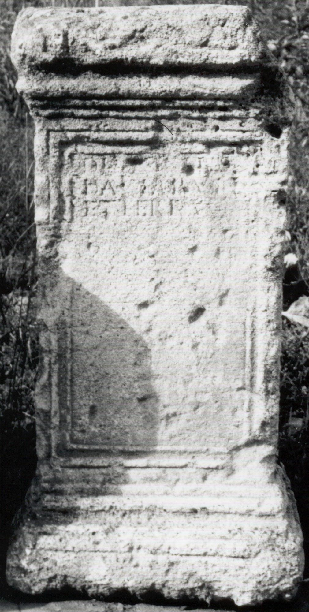
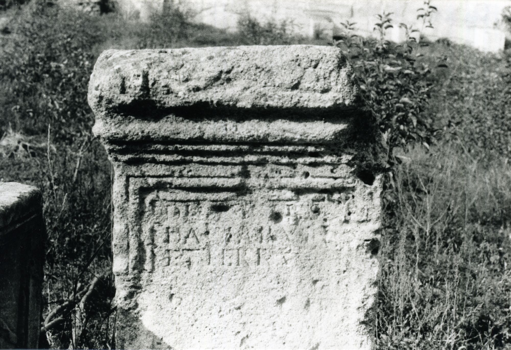
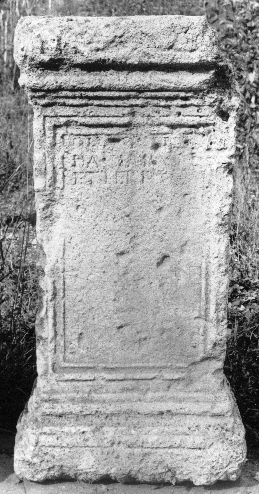
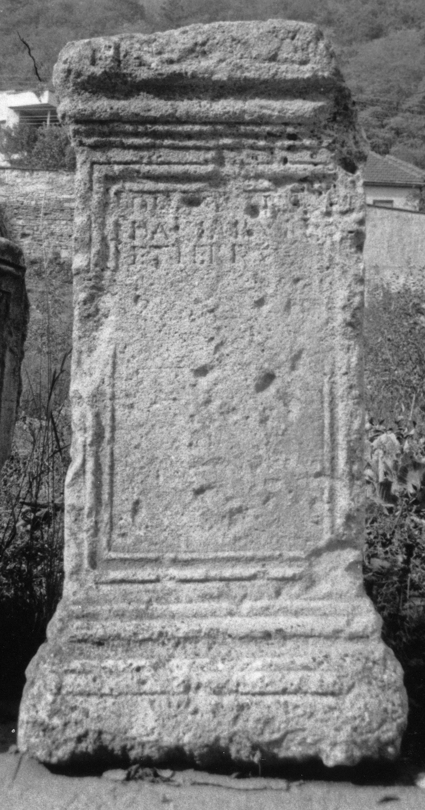

# EDH HD038016. Apulum

**Країна.** Румунія

**Провінція (код EDH).** Dac

**Місце знахідки (антична назва).** Apulum

**Сучасна назва.** Alba Iulia

**Деталі знахідки.** {Partoş}

**Координати.** 46.0463184,23.566650100

**Рік знахідки.** 1860

**Зберігання.** Deva, Muz. Civil. Dac. şi Rom.

**Датування (роки, від'ємні до н. е.).** 151 … 270

**Матеріал.** Sandstein

**Тип пам'ятки.** Altar?

**Розміри (висота, ширина, глибина, см).** 124.0 × 63.0 × 44.0

## Текст (латинь, скорочення розкрито)

```
Diis deabus(que) / Daciarum / et Terra(e?)
```

## Текст у вихідному записі

```
DIIS DEABVS / DACIARVM / ET TERRA
```

## Коментар

Altar oder Statuenbasis.

## Література

IDR 3, 5, 046; Foto u. Zeichnung.
- CIL 03, 00996. #

## Фото









Джерело https://edh.ub.uni-heidelberg.de/edh/inschrift/HD038016, ліцензія CC BY-SA 4.0. Оригінальний XML в архіві сирі_дані/edh_xml.zip
