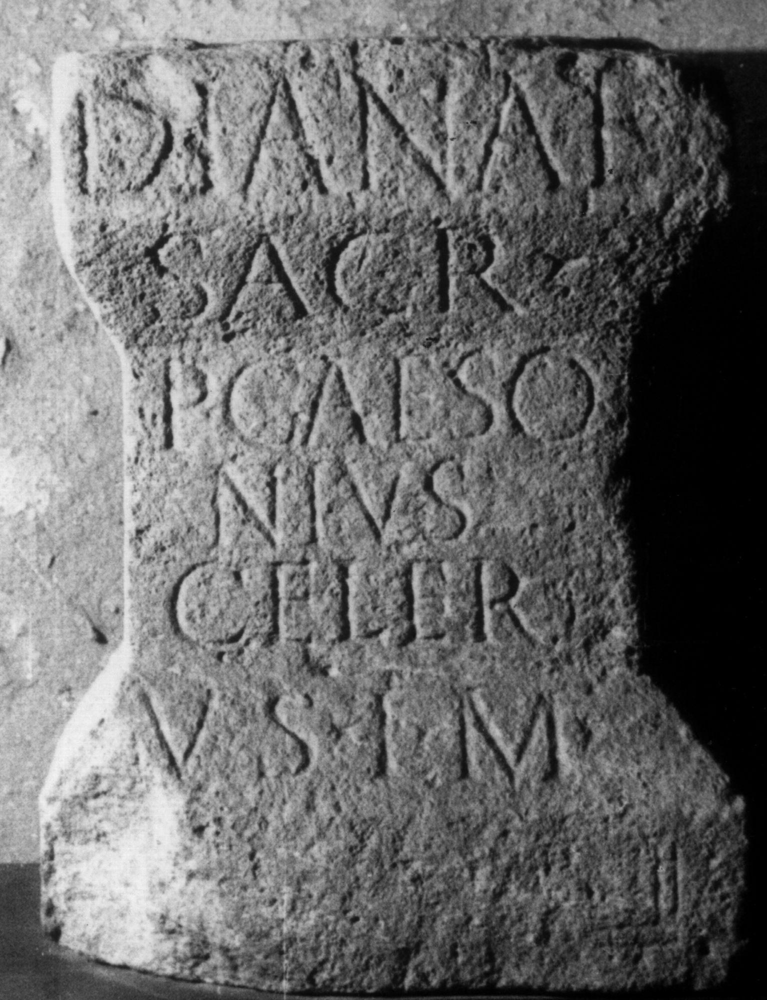

# EDH HD038019. Apulum

**Країна.** Румунія

**Провінція (код EDH).** Dac

**Місце знахідки (антична назва).** Apulum

**Сучасна назва.** Alba Iulia

**Деталі знахідки.** {Partoş}

**Координати.** 46.0463184,23.566650100

**Зберігання.** Sebeş, Muzeul

**Датування (роки, від'ємні до н. е.).** 107 … 200

**Матеріал.** Kalkstein

**Тип пам'ятки.** Altar?

**Розміри (висота, ширина, глибина, см).** 60.0 × 42.0 × 36.0

## Текст (латинь, скорочення розкрито)

```
Dianae // sacr(um) // P(ublius) <C=G>aeso/nius#<C>aeso/nius#GAESONIUS / Celer // v(otum) s(olvit) l(ibens) m(erito)
```

## Текст у вихідному записі

```
DIANAE / / SACR / / P GAESO / NIVS / CELER / / V S L M
```

## Коментар

Altar oder Statuenbasis. Z. 1 u. 2 befinden sich auf verschiedenen Teilen der corona, Z. 6 auf der Basis. (B): CIL III; IDR III: Z. 3: Caesonius.

## Література

IDR 3, 5, 050; Foto u. Zeichnung. (B)
- CIL 03, 06259. (B) #

## Фото



Джерело https://edh.ub.uni-heidelberg.de/edh/inschrift/HD038019, ліцензія CC BY-SA 4.0. Оригінальний XML в архіві сирі_дані/edh_xml.zip
