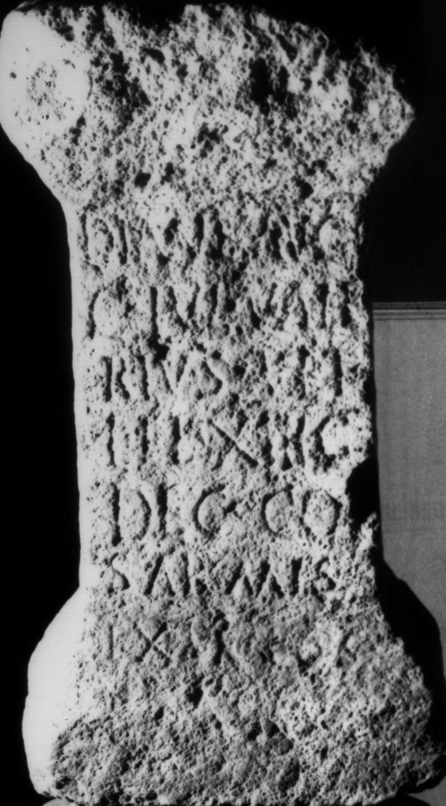

# EDH HD038029. Apulum

**Країна.** Румунія

**Провінція (код EDH).** Dac

**Місце знахідки (антична назва).** Apulum

**Сучасна назва.** Alba Iulia

**Деталі знахідки.** {Festung}

**Координати.** 46.068288248,23.571209907

**Зберігання.** Alba Iulia, Muz. Unirii

**Датування (роки, від'ємні до н. е.).** 193 … 211

**Матеріал.** Kalkstein

**Тип пам'ятки.** Altar?

**Розміри (висота, ширина, глибина, см).** 60.0 × 31.0 × 23.0

## Текст (латинь, скорочення розкрито)

```
Dian(a)e Aug(ustae) / C(aius) Iul(ius) Vale/rius vet(eranus) / leg(ionis) XIII g(eminae) / dec(urio) col(oniae) / Sar(mizegetusae) mis(sus) // ex b(ene)f(iciario) co(n)s(ularis)
```

## Текст у вихідному записі

```
DIANE AVG / C IVL VALE / RIVS VET / LEG XIII G / DEC COL / SAR MIS / / EX BF COS
```

## Коментар

Altar oder Statuenbasis. Z. 7 befindet sich auf der crepido.

## Література

IDR 3, 5, 060; Foto u. Zeichnung.
- CIL 03, 07742. #

## Фото



Джерело https://edh.ub.uni-heidelberg.de/edh/inschrift/HD038029, ліцензія CC BY-SA 4.0. Оригінальний XML в архіві сирі_дані/edh_xml.zip
