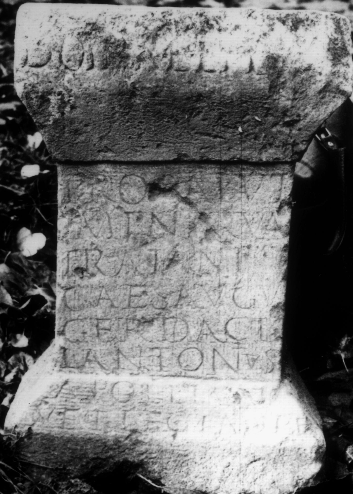
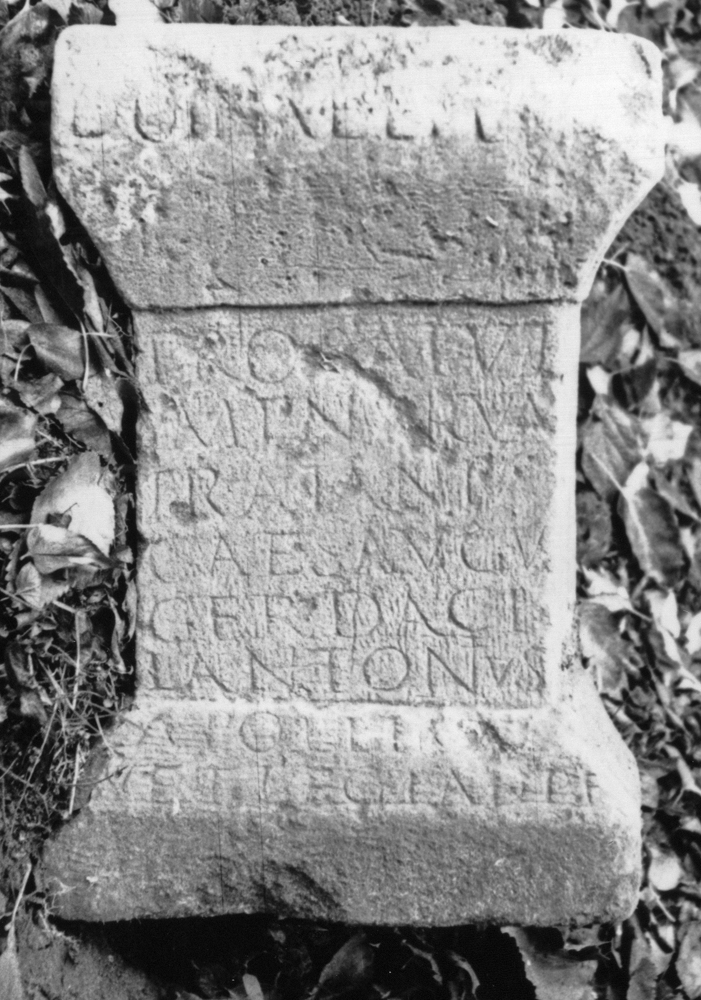
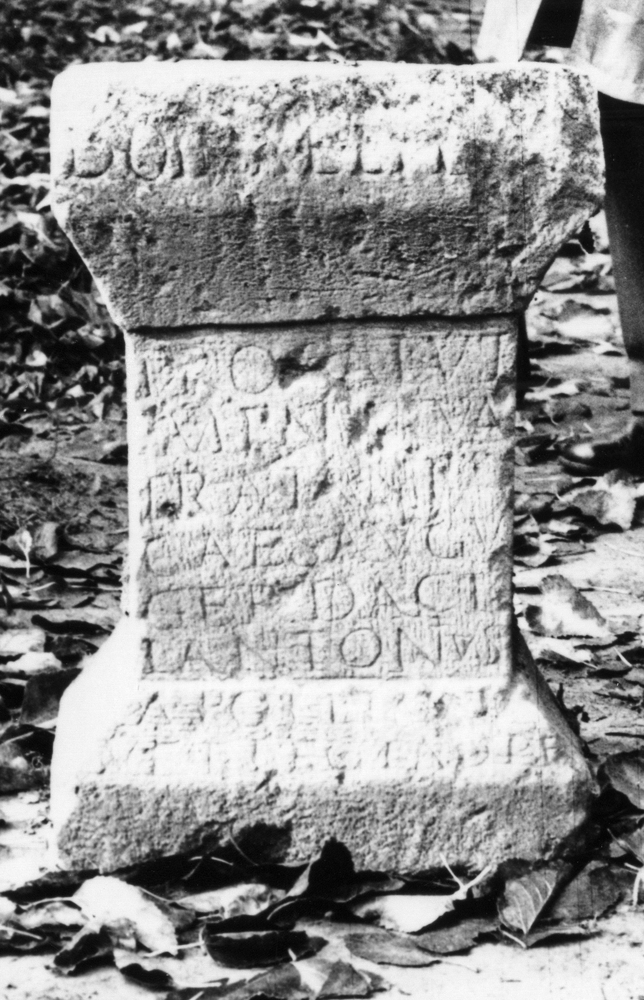

# EDH HD038049. Apulum

**Країна.** Румунія

**Провінція (код EDH).** Dac

**Місце знахідки (антична назва).** Apulum

**Сучасна назва.** Alba Iulia

**Деталі знахідки.** Festung, {Bischofspalast}

**Координати.** 46.067290787,23.568978309

**Зберігання.** Alba Iulia, Muz. Unirii

**Датування (роки, від'ємні до н. е.).** 106 … 115

**Матеріал.** Kalkstein

**Тип пам'ятки.** Altar?

**Розміри (висота, ширина, глибина, см).** 58.0 × 38.0 × 26.0

## Текст (латинь, скорочення розкрито)

```
Domin(o)(?) Aeter[n]o / pro salute / Imp(eratoris) Nerva(e) / Traiani / Caes(aris) Augu(sti) / Ger(manici) Daci(ci) L(ucius) Antonius / Apollin[aris] / vet(eranus) leg(ionis) I ad(iutricis) p(iae) f(idelis)
```

## Текст у вихідному записі

```
DOMIN AETER[ ]O / PRO SALVTE / IMP NERVA / TRAIANI / CAES AVGV / GER DACI L ANTONIVS / APOLLIN[ ] / VET LEG I AD P F
```

## Коментар

Altar oder Statuenbasis. (B): CIL III: Z. 1: Dominae et d(is) o. d(eae).

## Література

IDR 3, 5, 065; Foto u. Zeichnung.
- CIL 03, 01004. (B) #

## Фото







Джерело https://edh.ub.uni-heidelberg.de/edh/inschrift/HD038049, ліцензія CC BY-SA 4.0. Оригінальний XML в архіві сирі_дані/edh_xml.zip
