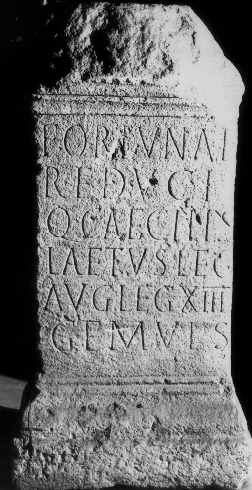
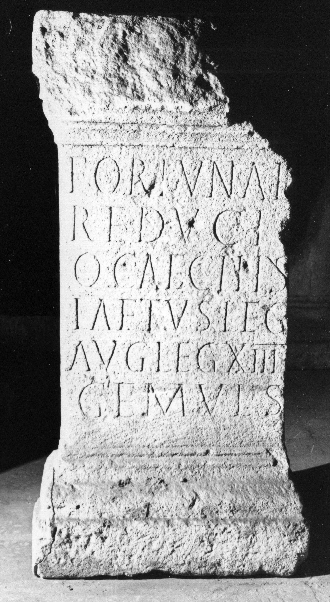

# EDH HD038086. Apulum

**Країна.** Румунія

**Провінція (код EDH).** Dac

**Місце знахідки (антична назва).** Apulum

**Сучасна назва.** Alba Iulia

**Деталі знахідки.** {Festung}, Mauer, sekundär verwendet

**Координати.** 46.068288248,23.571209907

**Рік знахідки.** -1857

**Зберігання.** Deva, Muz. Civil. Dac. şi Rom.

**Датування (роки, від'ємні до н. е.).** 185 … 270

**Матеріал.** Kalkstein

**Тип пам'ятки.** Altar?

**Розміри (висота, ширина, глибина, см).** 113.0 × 57.0 × 24.0

## Текст (латинь, скорочення розкрито)

```
Fortunae / Reduci / Q(uintus) Caecilius / Laetus leg(atus) / Aug(usti) leg(ionis) XIII / gem(inae) v(otum) l(ibens) s(olvit)
```

## Текст у вихідному записі

```
FORTVNAE / REDVCI / Q CAECILIVS / LAETVS LEG / AVG LEG XIII / GEM V L S
```

## Коментар

Altar oder Statuenbasis. Fundjahr: zwischen 1767 und 1857. Datierung: zwischen 185 und 188 n. Chr., 193/4 und 197 n. Chr. oder ins 3. Jh. n. Chr.

## Література

IDR 3, 5, 077; Foto.
- CIL 03, 01011. #

## Фото





Джерело https://edh.ub.uni-heidelberg.de/edh/inschrift/HD038086, ліцензія CC BY-SA 4.0. Оригінальний XML в архіві сирі_дані/edh_xml.zip
