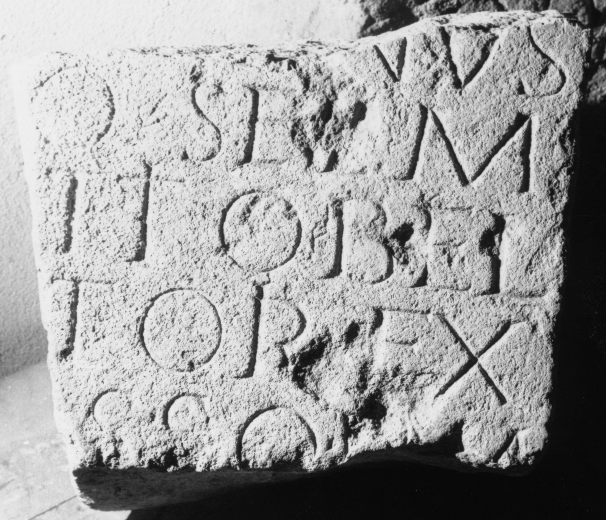

# EDH HD038099. Apulum

**Країна.** Румунія

**Провінція (код EDH).** Dac

**Місце знахідки (антична назва).** Apulum

**Сучасна назва.** Alba Iulia

**Деталі знахідки.** {Festung}, Mauer, sekundär verwendet

**Координати.** 46.068288248,23.571209907

**Зберігання.** Alba Iulia, Muz. Unirii

**Датування (роки, від'ємні до н. е.).** 151 … 230

**Матеріал.** Kalkstein

**Тип пам'ятки.** Altar?

**Розміри (висота, ширина, глибина, см).** -28.0 × -36.0 × -23.0

## Текст (латинь, скорочення розкрито)

```
[Genio loc(i)] / [et For(tunae)? magnae] / [Q(uintus) Appianius? Mate?]rnus / [pr]o se e[t] M(arco) / [Ve]ttio Bel/[la]tori ex / [iu]sso(!) l(ibens) m(erito) / [posuit?]
```

## Текст у вихідному записі

```
[ ] / [ ] / [ ]RNVS / [ ]O SE E[ ] M / [ ]TTIO BEL / [ ]TORI EX / [ ]SSO L M / [ ]
```

## Коментар

Fragment eines Altars oder einer Statuenbasis. Inschrift bei der Auffindung noch vollständig erhalten. Z. 5 u. 6: hederae. Z. 3: auch Arrianius möglich. (B): CIL III: Z. 3: Appianus; Z. 5: v(oto) l(ibenter?) s(uspecto?) sol(vit) m(erito).

## Література

IDR 3, 5, 083; Foto u. Zeichnung.
- CIL 03, 01018. (B) #

## Фото



Джерело https://edh.ub.uni-heidelberg.de/edh/inschrift/HD038099, ліцензія CC BY-SA 4.0. Оригінальний XML в архіві сирі_дані/edh_xml.zip
