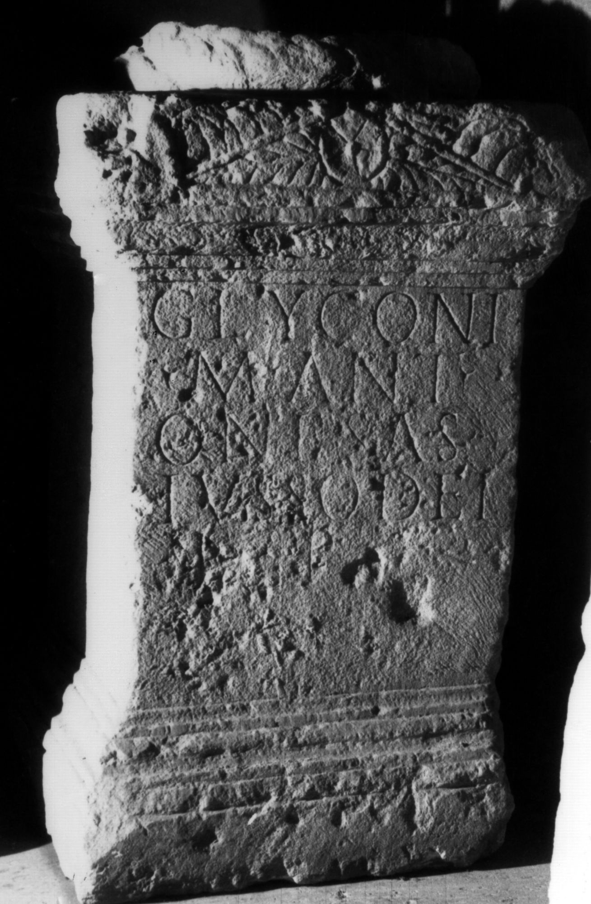
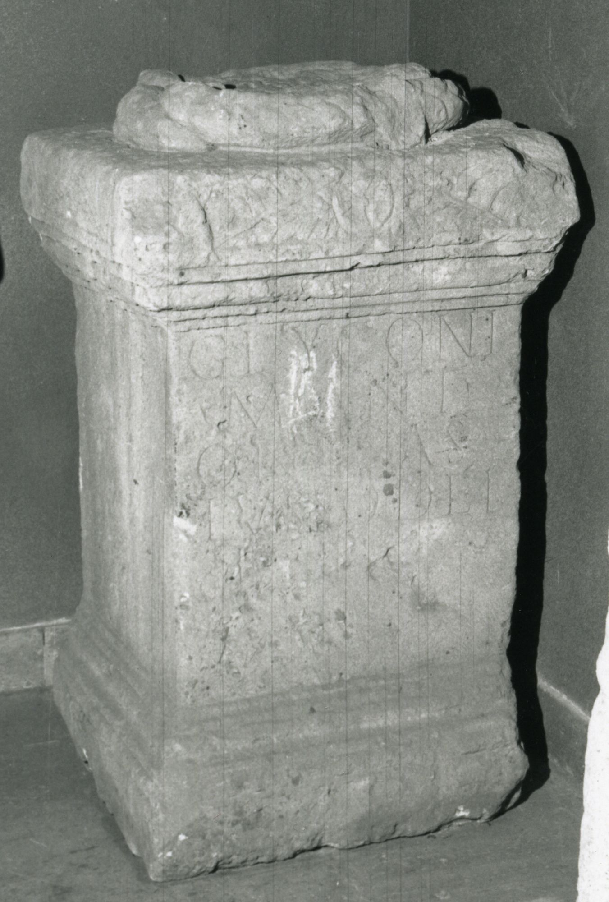

# EDH HD038106. Apulum

**Країна.** Румунія

**Провінція (код EDH).** Dac

**Місце знахідки (антична назва).** Apulum

**Сучасна назва.** Alba Iulia

**Деталі знахідки.** {Festung}

**Координати.** 46.068288248,23.571209907

**Зберігання.** Alba Iulia, Muz. Unirii

**Датування (роки, від'ємні до н. е.).** 161 … 192

**Матеріал.** Kalkstein

**Тип пам'ятки.** Altar

**Розміри (висота, ширина, глибина, см).** 102.0 × 51.0 × 50.0

## Текст (латинь, скорочення розкрито)

```
Glyconi / M(arcus) Ant(onius) / Onesas / iusso dei / l(ibens) p(osuit)
```

## Текст у вихідному записі

```
GLYCONI / M ANT / ONESAS / IVSSO DEI / L P
```

## Література

IDR 3, 5, 085; Foto.
- CIL 03, 01021. #

## Фото





Джерело https://edh.ub.uni-heidelberg.de/edh/inschrift/HD038106, ліцензія CC BY-SA 4.0. Оригінальний XML в архіві сирі_дані/edh_xml.zip
