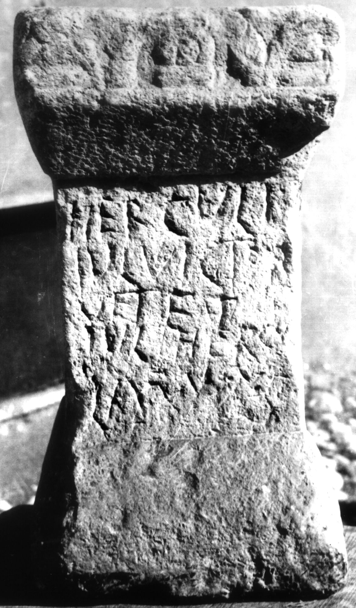
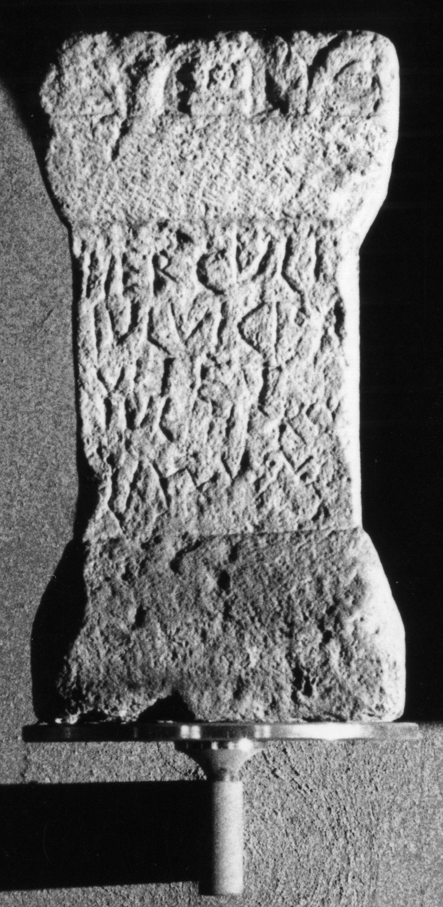

# EDH HD038112. Apulum

**Країна.** Румунія

**Провінція (код EDH).** Dac

**Місце знахідки (антична назва).** Apulum

**Сучасна назва.** Alba Iulia

**Деталі знахідки.** {Partoş}

**Координати.** 46.0463184,23.566650100

**Рік знахідки.** 1926

**Зберігання.** Alba Iulia, Muz. Unirii

**Датування (роки, від'ємні до н. е.).** 151 … 270

**Матеріал.** Kalkstein

**Тип пам'ятки.** Altar

**Розміри (висота, ширина, глибина, см).** 42.0 × 22.0 × 22.0

## Текст (латинь, скорочення розкрито)

```
Herculi / Iul(ius) Victor / vet(eranus) et / Iul(ius) Hercu/lanus v(otum) s(olverunt) l(ibenter)(?)
```

## Текст у вихідному записі

```
HERCVLI / IVL VICTOR / VET ET / IVL HERCV / LANVS V S L
```

## Література

IDR 3, 5, 091; Foto u. Zeichnung. #

## Фото





Джерело https://edh.ub.uni-heidelberg.de/edh/inschrift/HD038112, ліцензія CC BY-SA 4.0. Оригінальний XML в архіві сирі_дані/edh_xml.zip
