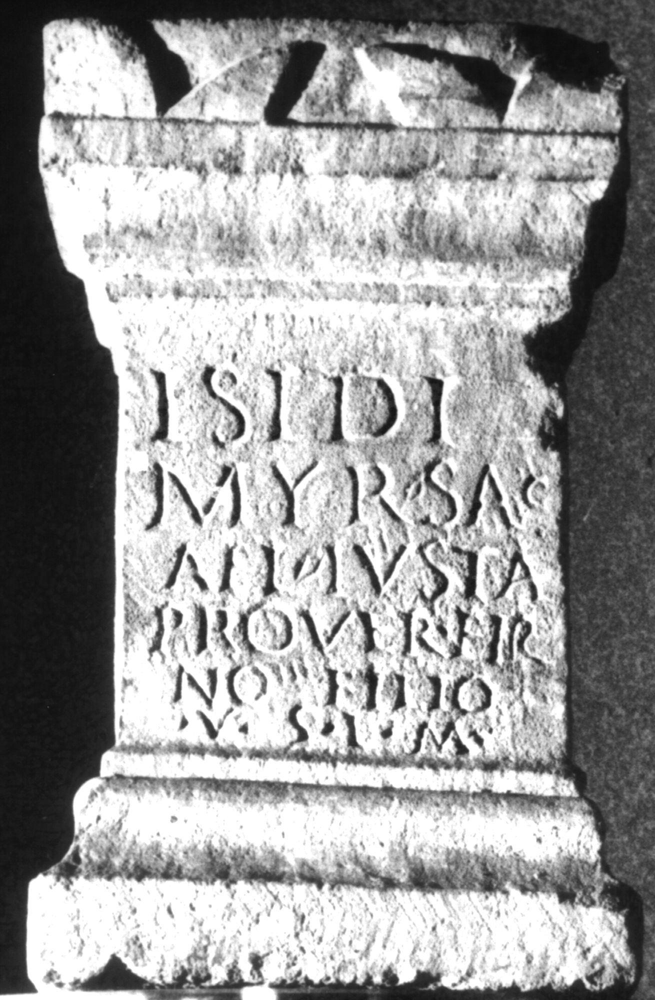

# EDH HD038148. Apulum

**Країна.** Румунія

**Провінція (код EDH).** Dac

**Місце знахідки (антична назва).** Apulum

**Сучасна назва.** Alba Iulia

**Деталі знахідки.** {Partoş}

**Координати.** 46.0463184,23.566650100

**Рік знахідки.** 1958

**Зберігання.** Alba Iulia, Muz. Unirii

**Датування (роки, від'ємні до н. е.).** 131 … 230

**Матеріал.** Kalkstein

**Тип пам'ятки.** Altar

**Розміри (висота, ширина, глибина, см).** 32.0 × 20.0 × 14.0

## Текст (латинь, скорочення розкрито)

```
Isidi / myr(ionimae) sac(rum) / Ael(ia) Iusta / pro Ver(---) Fir/<m=N>o#Fir/<m>o#FIRNO filio / v(otum) s(olvit) l(ibens) m(erito)
```

## Текст у вихідному записі

```
ISIDI / MYR SAC / AEL IVSTA / PRO VER FIR / NO FILIO / V S L M
```

## Коментар

Z. 2 u. 3: hederae als Worttrenner.

## Література

IDR 3, 5, 104; Foto.
- SIRIS 692.
- L. Bricault, Recueil des inscriptions concernant les cultes Isiaques (RICIS) (Paris 2005) 731, Nr. 616/0404; pl. 127, 616/404. #

## Фото



Джерело https://edh.ub.uni-heidelberg.de/edh/inschrift/HD038148, ліцензія CC BY-SA 4.0. Оригінальний XML в архіві сирі_дані/edh_xml.zip
