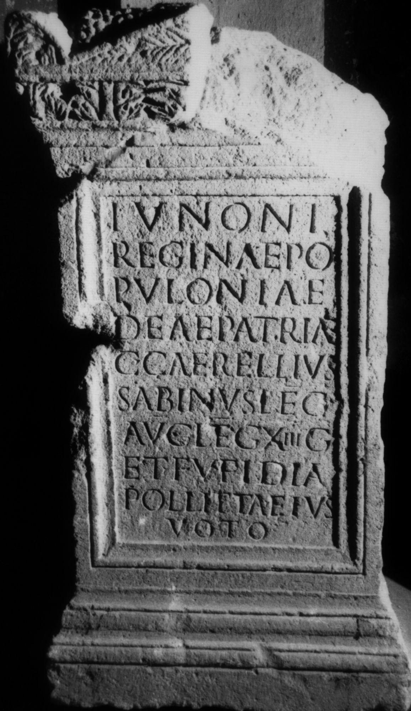
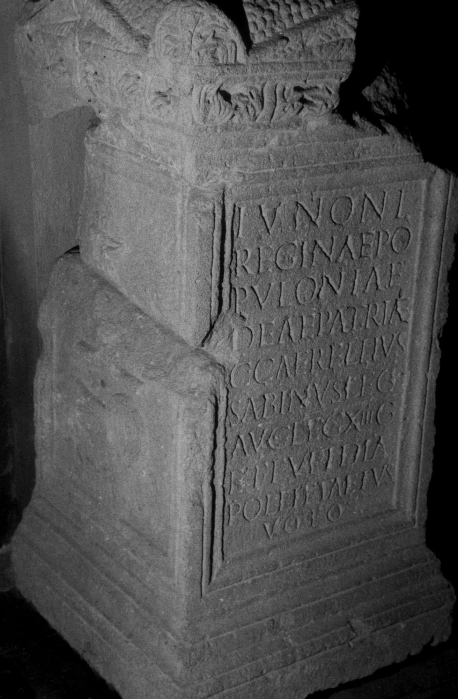
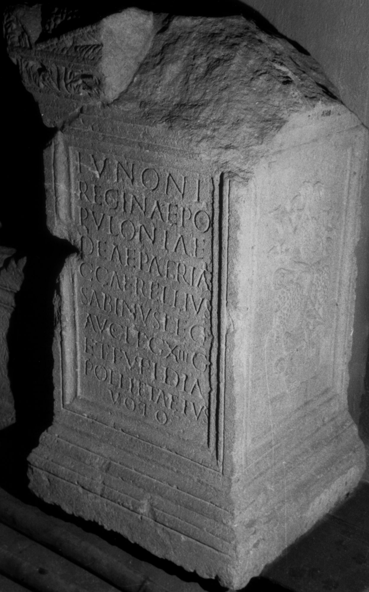
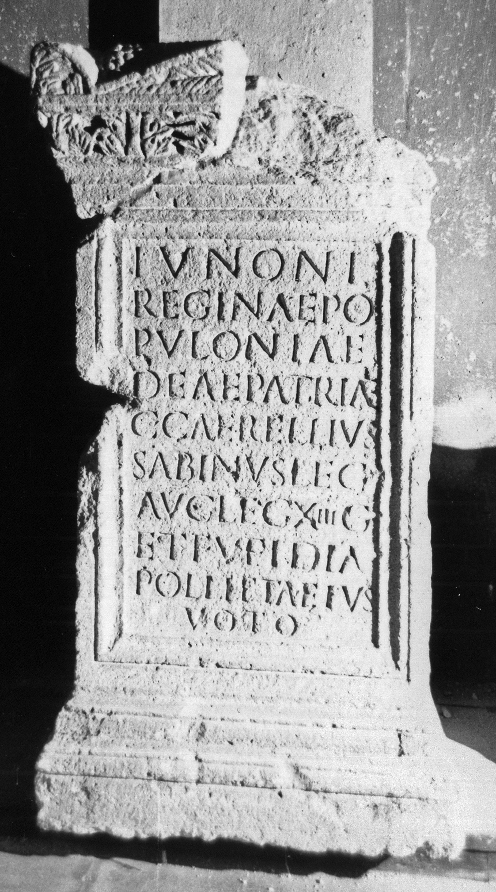

# EDH HD038165. Apulum

**Країна.** Румунія

**Провінція (код EDH).** Dac

**Місце знахідки (антична назва).** Apulum

**Сучасна назва.** Alba Iulia

**Деталі знахідки.** Festung, {Niedertor}, bei

**Координати.** 46.068312191,23.576273685

**Зберігання.** Sibiu, Muz. Brukenthal

**Датування (роки, від'ємні до н. е.).** 183 … 185

**Матеріал.** Kalkstein

**Тип пам'ятки.** Altar

**Розміри (висота, ширина, глибина, см).** 130.0 × 72.0 × 68.0

## Текст (латинь, скорочення розкрито)

```
Iunoni / Reginae Po/puloniae / deae patriae / C(aius) Caerellius / Sabinus leg(atus) / Aug(usti) leg(ionis) XIII g(eminae) / et Fufidia / Pollitta eius / voto
```

## Текст у вихідному записі

```
IVNONI / REGINAE PO / PVLONIAE / DEAE PATRIAE / C CAERELLIVS / SABINVS LEG / AVG LEG XIII G / ET FVFIDIA / POLLITTA EIVS / VOTO
```

## Література

IDR 3, 5, 107; Foto.
- CIL 03, 01075.
- PIR (2. Aufl.) C 161.
- A. Buonopane - V. La Monaca, in: G.P. Marchi - J. Pál (Hrsg.), Epigrafi romane di Transilvania. Bibliotheca Capitolare di Verona, Manoscritto CCLXVII (Verona - Szeged 2010) 331, Nr. 15; Foto u. Zeichnung. #

## Фото









Джерело https://edh.ub.uni-heidelberg.de/edh/inschrift/HD038165, ліцензія CC BY-SA 4.0. Оригінальний XML в архіві сирі_дані/edh_xml.zip
