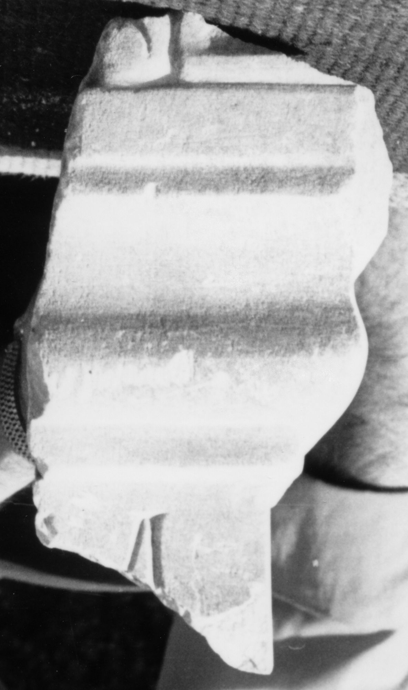

# EDH HD038185. Apulum

**Країна.** Румунія

**Провінція (код EDH).** Dac

**Місце знахідки (антична назва).** Apulum

**Сучасна назва.** Alba Iulia

**Деталі знахідки.** Festung, {S. Michael, katholische Kathedrale}, sekundär verwendet

**Координати.** 46.067648088,23.569900989

**Рік знахідки.** -1977

**Зберігання.** Alba Iulia, Muz. Unirii

**Датування (роки, від'ємні до н. е.).** 107 … 275

**Матеріал.** Marmor

**Тип пам'ятки.** Altar

**Розміри (висота, ширина, глибина, см).** -18.0 × -9.5 × -18.0

## Текст (латинь, скорочення розкрито)

```
[I(ovi)? O(ptimo)?] M(aximo) / [&
```

## Текст у вихідному записі

```
[ ] M / [
```

## Коментар

Fundjahr: zwischen 1973 und 1977.

## Література

IDR 3, 5, 121; Foto u. Zeichnung. #

## Фото



Джерело https://edh.ub.uni-heidelberg.de/edh/inschrift/HD038185, ліцензія CC BY-SA 4.0. Оригінальний XML в архіві сирі_дані/edh_xml.zip
