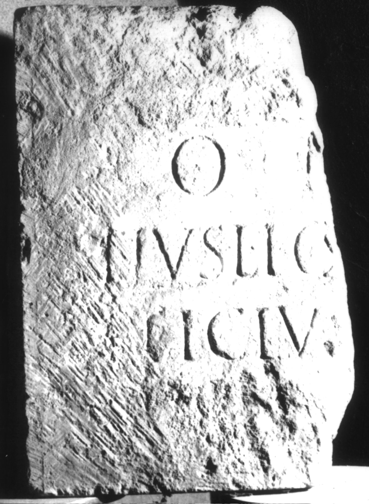

# EDH HD038209. Apulum

**Країна.** Румунія

**Провінція (код EDH).** Dac

**Місце знахідки (антична назва).** Apulum

**Сучасна назва.** Alba Iulia

**Координати.** 46.0669444,23.569999999

**Зберігання.** Alba Iulia, Muz. Unirii

**Датування (роки, від'ємні до н. е.).** 151 … 250

**Матеріал.** Kalkstein

**Тип пам'ятки.** Altar?

**Розміри (висота, ширина, глибина, см).** -58.0 × -39.0 × -17.0

## Текст (латинь, скорочення розкрито)

```
[I(ovi)] O(ptimo) M(aximo) [---?] / [A?]ticius Lig[--- et?] / [---]ticius [---] / [---]V[---] / [&
```

## Текст у вихідному записі

```
[ ] O M [ ] / [ ]TICIVS LIG[ ] / [ ]TICIVS [ ] / [ ]V[ ] / [
```

## Коментар

Fragment eines Altars oder einer Statuenbasis. Nur rechter oberer Teil des Inschriftfeldes erhalten.

## Література

IDR 3, 5, 131; Foto u. Zeichnung. #

## Фото



Джерело https://edh.ub.uni-heidelberg.de/edh/inschrift/HD038209, ліцензія CC BY-SA 4.0. Оригінальний XML в архіві сирі_дані/edh_xml.zip
