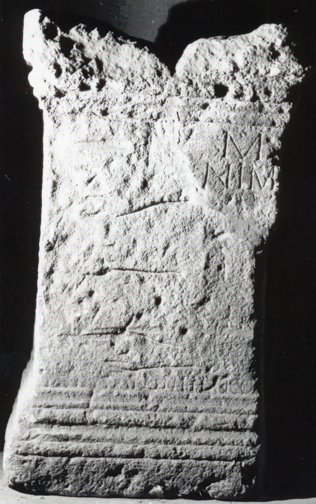

# EDH HD038210. Apulum

**Країна.** Румунія

**Провінція (код EDH).** Dac

**Місце знахідки (антична назва).** Apulum

**Сучасна назва.** Alba Iulia

**Координати.** 46.0669444,23.569999999

**Зберігання.** Alba Iulia, Muz. Unirii

**Датування (роки, від'ємні до н. е.).** 151 … 250

**Матеріал.** Kalkstein

**Тип пам'ятки.** Statuenbasis

**Розміри (висота, ширина, глибина, см).** -96.0 × 56.0 × 40.0

## Текст (латинь, скорочення розкрито)

```
[I(ovi) O(ptimo)] M(aximo) / [pro sal(ute)] d(omini) n(ostri) Im/[peratoris] M(arci) Au[reli ---] / [------] / [------] / [------] / [---]III[-] co(n)s(ulibus)(?)
```

## Текст у вихідному записі

```
[ ] M / [ ] D N IM / [ ] M AV[ ] / [ ] / [ ] / [ ] / [ ]III[ ] COS
```

## Коментар

Großer Teil des Inschriftfeldes verwittert.

## Література

IDR 3, 5, 132; Foto u. Zeichnung. #

## Фото



Джерело https://edh.ub.uni-heidelberg.de/edh/inschrift/HD038210, ліцензія CC BY-SA 4.0. Оригінальний XML в архіві сирі_дані/edh_xml.zip
