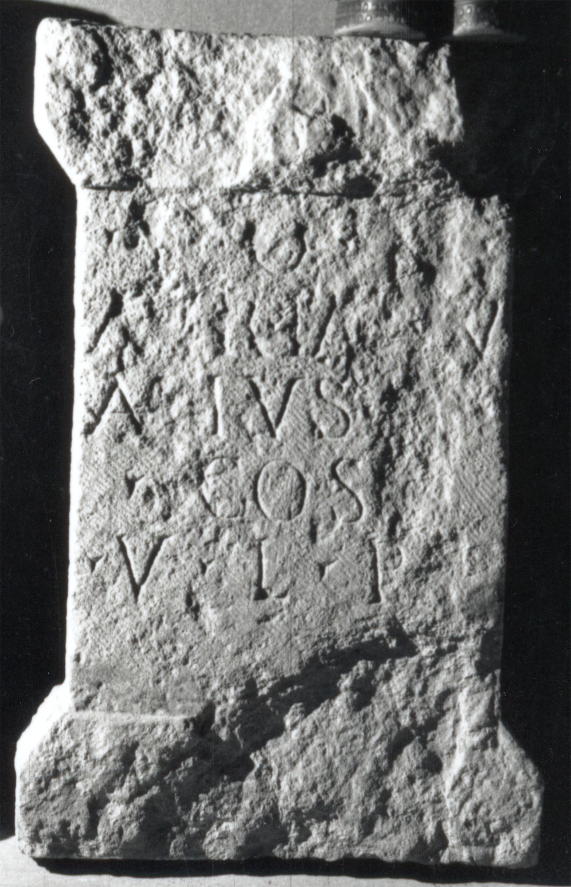

# EDH HD038213. Apulum

**Країна.** Румунія

**Провінція (код EDH).** Dac

**Місце знахідки (антична назва).** Apulum

**Сучасна назва.** Alba Iulia

**Деталі знахідки.** Praetorium des Statthalters

**Координати.** 46.076691,23.580099

**Датування (роки, від'ємні до н. е.).** 168 … 275

**Матеріал.** Kalkstein

**Тип пам'ятки.** Altar?

**Розміри (висота, ширина, глибина, см).** -91.0 × 55.0 × 21.0

## Текст (латинь, скорочення розкрито)

```
I(ovi) O(ptimo) M(aximo) / Aur(elius) Ia[n]u/arius [b(ene)f(iciarius)?] / co(n)s(ularis) / v(oto) l(ibens) p(osuit)
```

## Текст у вихідному записі

```
I O M / AVR IA[ ]V / ARIVS [ ] / COS / V L P
```

## Коментар

Altar oder Statuenbasis. Oberer Teil nicht erhalten.

## Література

IDR 3, 5, 135; Foto u. Zeichnung. #

## Фото



Джерело https://edh.ub.uni-heidelberg.de/edh/inschrift/HD038213, ліцензія CC BY-SA 4.0. Оригінальний XML в архіві сирі_дані/edh_xml.zip
