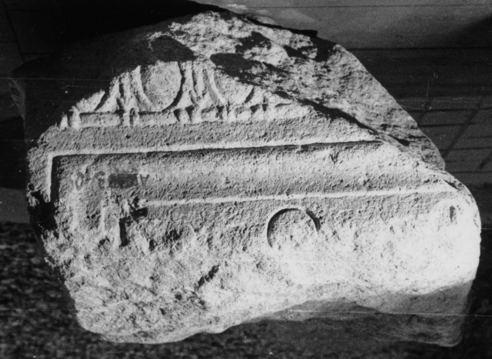

# EDH HD038216. Apulum

**Країна.** Румунія

**Провінція (код EDH).** Dac

**Місце знахідки (антична назва).** Apulum

**Сучасна назва.** Alba Iulia

**Деталі знахідки.** Festung, {Niedertor}, bei

**Координати.** 46.068312191,23.576273685

**Зберігання.** Sibiu, Muz. Brukenthal

**Датування (роки, від'ємні до н. е.).** 183 … 185

**Матеріал.** Kalkstein

**Тип пам'ятки.** Altar

**Розміри (висота, ширина, глибина, см).** -28.0 × -50.0 × -50.0

## Текст (латинь, скорочення розкрито)

```
I(ovi) O(ptimo) M(aximo) / [C(aius) Caerellius] / [Sabinus leg(atus)] / [Aug(usti) leg(ionis) XIII g(eminae)] / [et Fufidia] / [Pollitta eius] / [voto]
```

## Текст у вихідному записі

```
I O M / [ ] / [ ] / [ ] / [ ] / [ ] / [ ]
```

## Коментар

Altar bei der Auffindung vollständig; heute nur ein Fragment vom oberen Teil erhalten.

## Література

IDR 3, 5, 139; Foto u. Zeichnung.
- CIL 03, 01074.
- ILS 3085.
- PIR (2. Aufl.) C 161. #

## Фото



Джерело https://edh.ub.uni-heidelberg.de/edh/inschrift/HD038216, ліцензія CC BY-SA 4.0. Оригінальний XML в архіві сирі_дані/edh_xml.zip
