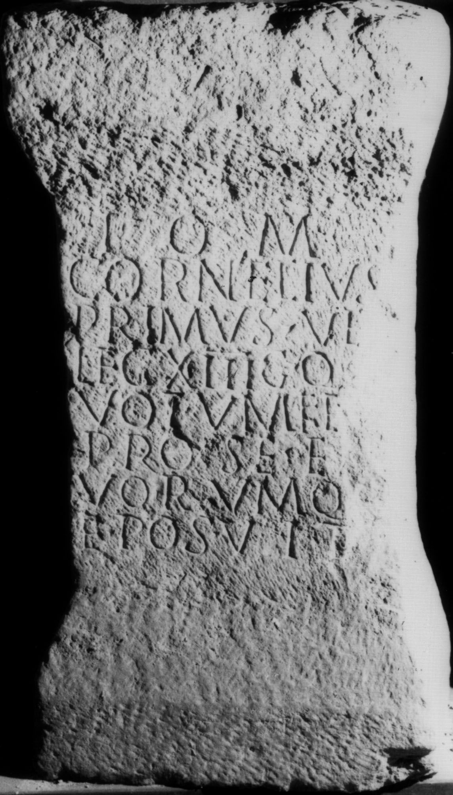

# EDH HD038221. Apulum

**Країна.** Румунія

**Провінція (код EDH).** Dac

**Місце знахідки (антична назва).** Apulum

**Сучасна назва.** Alba Iulia

**Деталі знахідки.** {Partoş}

**Координати.** 46.0463184,23.566650100

**Рік знахідки.** 1840

**Зберігання.** Sibiu, Muz. Brukenthal

**Датування (роки, від'ємні до н. е.).** 171 … 270

**Матеріал.** Kalkstein

**Тип пам'ятки.** Altar?

**Розміри (висота, ширина, глибина, см).** 95.0 × 50.0 × 41.0

## Текст (латинь, скорочення розкрито)

```
I(ovi) O(ptimo) M(aximo) / Cornelius / Primus vet(eranus) / leg(ionis) XIII g(eminae) q(u)ot / votum fecit / pro se et s/uorumqu/e posuit
```

## Текст у вихідному записі

```
I O M / CORNELIVS / PRIMVS VET / LEG XIII G QOT / VOTVM FECIT / PRO SE ET S / VORVMQV / E POSVIT
```

## Коментар

Altar oder Statuenbasis.

## Література

IDR 3, 5, 143; Foto u. Zeichnung.
- CIL 03, 01041. #

## Фото



Джерело https://edh.ub.uni-heidelberg.de/edh/inschrift/HD038221, ліцензія CC BY-SA 4.0. Оригінальний XML в архіві сирі_дані/edh_xml.zip
