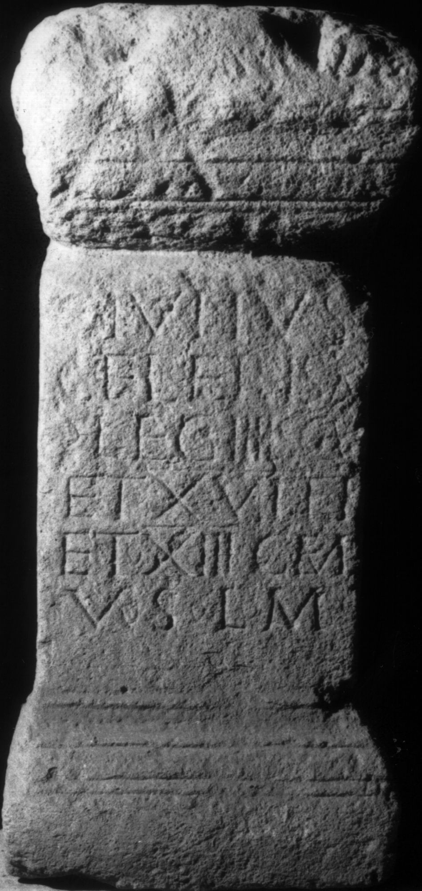

# EDH HD038231. Apulum

**Країна.** Румунія

**Провінція (код EDH).** Dac

**Місце знахідки (антична назва).** Apulum

**Сучасна назва.** Alba Iulia

**Деталі знахідки.** {Festung}

**Координати.** 46.068288248,23.571209907

**Рік знахідки.** 1840

**Зберігання.** Alba Iulia, Muz. Unirii

**Датування (роки, від'ємні до н. е.).** 151 … 270

**Матеріал.** Kalkstein

**Тип пам'ятки.** Altar

**Розміри (висота, ширина, глибина, см).** 95.0 × 44.0 × 40.0

## Текст (латинь, скорочення розкрито)

```
I(ovi) O(ptimo) M(aximo) / C(aius) Iulius / Celer Isa(uria?) / |(centurio) leg(ionis) IIII Scy(thicae) / et XVI F(laviae) f(irmae) / et XIII gem(inae) / v(otum) s(olvit) l(ibens) m(erito)
```

## Текст у вихідному записі

```
I O M / C IVLIVS / CELER ISA / | LEG IIII SCY / ET XVI F F / ET XIII GEM / V S L M
```

## Коментар

Z. 6-7: hederae. CIL III: Z. 3: Isa(uria) o. Isa(ura).

## Література

IDR 3, 5, 148; Foto u. Zeichnung.
- CIL 03, 01044. #

## Фото



Джерело https://edh.ub.uni-heidelberg.de/edh/inschrift/HD038231, ліцензія CC BY-SA 4.0. Оригінальний XML в архіві сирі_дані/edh_xml.zip
