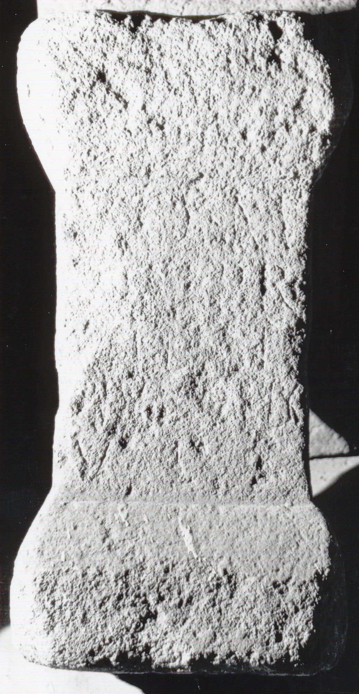

# EDH HD038245. Apulum

**Країна.** Румунія

**Провінція (код EDH).** Dac

**Місце знахідки (антична назва).** Apulum

**Сучасна назва.** Alba Iulia

**Деталі знахідки.** {Festung}

**Координати.** 46.068288248,23.571209907

**Зберігання.** Alba Iulia, Muz. Unirii

**Датування (роки, від'ємні до н. е.).** 171 … 270

**Матеріал.** Sandstein

**Тип пам'ятки.** Altar

**Розміри (висота, ширина, глибина, см).** 61.0 × 39.0 × 28.0

## Текст (латинь, скорочення розкрито)

```
I(ovi) O(ptimo) M(aximo) / Sempr(onius) Valenti/nus b(ene)[f(iciarius)] leg(ati) / v(otum) l(ibens) s(olvit)
```

## Текст у вихідному записі

```
I O M / SEMPR VALENTI / NVS B[ ] LEG / V L S
```

## Література

IDR 3, 5, 163; Foto.
- CIL 03, 01050.
- A. Buonopane - V. La Monaca, in: G.P. Marchi - J. Pál (Hrsg.), Epigrafi romane di Transilvania. Bibliotheca Capitolare di Verona, Manoscritto CCLXVII (Verona - Szeged 2010) 349, Nr. 333; Foto u. Zeichnung. #

## Фото



Джерело https://edh.ub.uni-heidelberg.de/edh/inschrift/HD038245, ліцензія CC BY-SA 4.0. Оригінальний XML в архіві сирі_дані/edh_xml.zip
