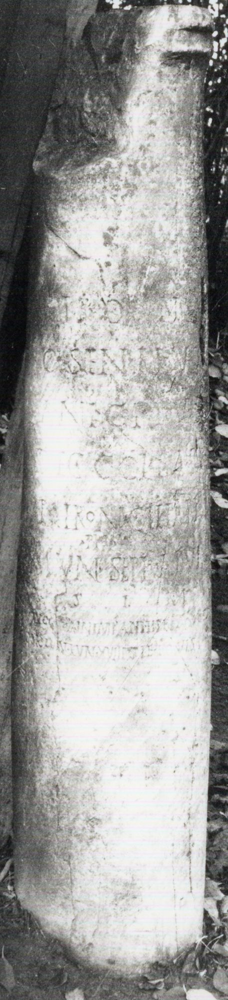
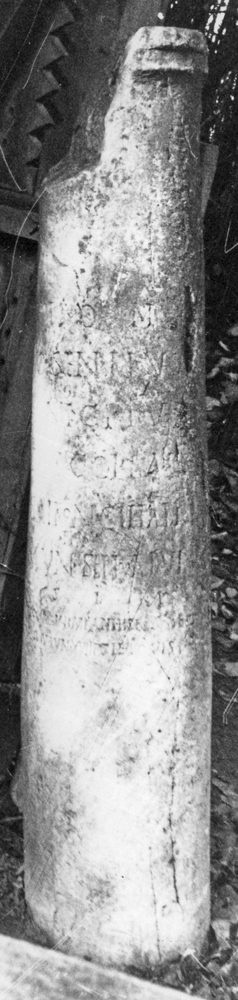
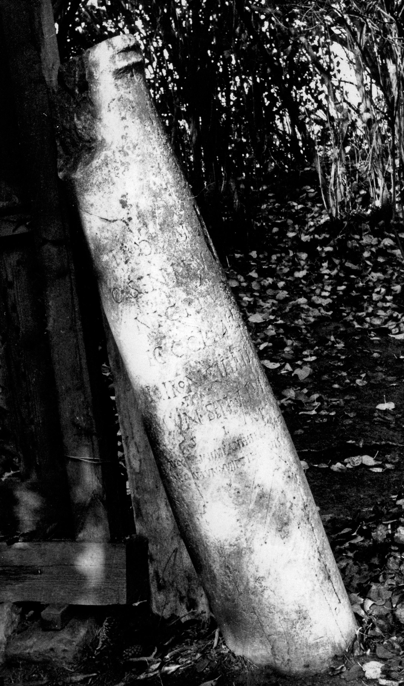

# EDH HD038246. Apulum

**Країна.** Румунія

**Провінція (код EDH).** Dac

**Місце знахідки (антична назва).** Apulum

**Сучасна назва.** Alba Iulia

**Деталі знахідки.** Festung, {Bischofspalast}

**Координати.** 46.067290787,23.568978309

**Зберігання.** Alba Iulia, katholischer Bischofssitz

**Датування (роки, від'ємні до н. е.).** 205 … 

**Матеріал.** Kalkstein

**Тип пам'ятки.** EhrenVotivsäule

**Розміри (висота, ширина, глибина, см).** -185.0 × 30.0

## Текст (латинь, скорочення розкрито)

```
I(ovi) O(ptimo) M(aximo) / C(aius) Sentius / Anicetus / dec(urio) col(oniae) Sar(mizegetusae) / patron(us) coll(egii) fabr(um) / prim(us) / mun(icipii) Sept(imii) Apul(ensis) / v(otum) s(olvit) l(ibens) m(erito) / Augg(ustis) nn(ostris) Imp(eratoribus) Ant(onino) II et [[[Geta]]] co(n)s(ulibus) / (ante diem) X K(alendas) Iun(ias) lun(a) XVIII die Iovis
```

## Текст у вихідному записі

```
I O M / C SENTIVS / ANICETVS / DEC COL SAR / PATRON COLL FABR / PRIM / MVN SEPT APVL / V S L M / AVGG NN IMP ANT II ET [[[ ]]] COS / X K IVN LVN XVIII DIE IOVIS
```

## Коментар

Z. 9: Geta, ursprünglich eradiert.

## Література

IDR 3, 5, 164; Foto u. Zeichnung.
- CIL 03, 01051.
- ILS 7144. #

## Фото







Джерело https://edh.ub.uni-heidelberg.de/edh/inschrift/HD038246, ліцензія CC BY-SA 4.0. Оригінальний XML в архіві сирі_дані/edh_xml.zip
