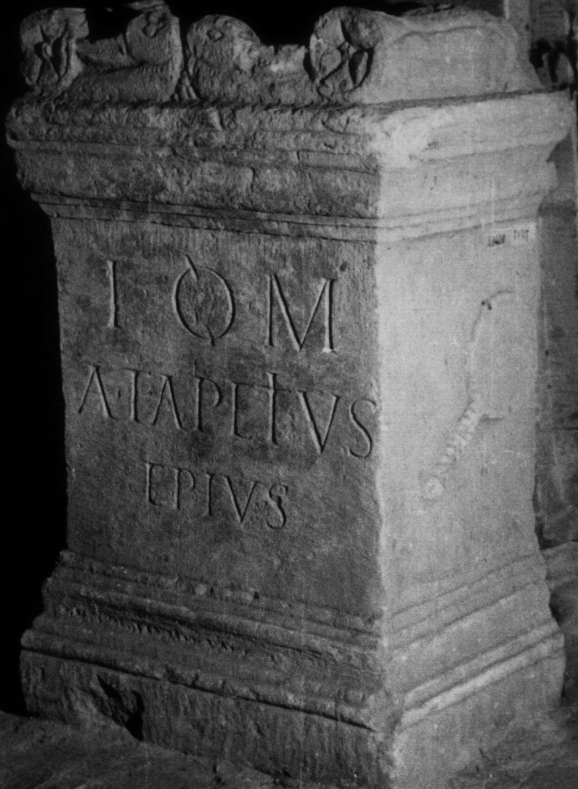
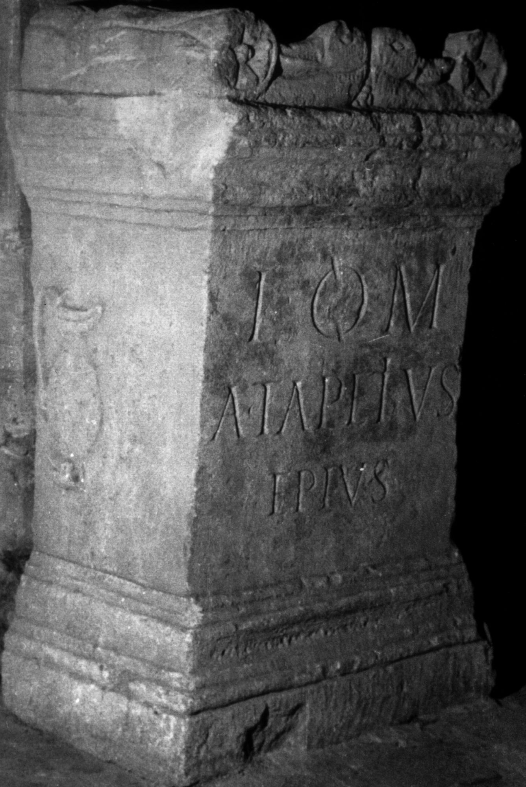

# EDH HD038248. Apulum

**Країна.** Румунія

**Провінція (код EDH).** Dac

**Місце знахідки (антична назва).** Apulum

**Сучасна назва.** Alba Iulia

**Деталі знахідки.** {Partoş}

**Координати.** 46.0463184,23.566650100

**Зберігання.** Sibiu, Muz. Brukenthal

**Датування (роки, від'ємні до н. е.).** 151 … 230

**Матеріал.** Gesteine

**Тип пам'ятки.** Altar

**Розміри (висота, ширина, глибина, см).** 88.0 × 57.0 × 39.0

## Текст (латинь, скорочення розкрито)

```
I(ovi) O(ptimo) M(aximo) / A(ulus) Tapetius / Epius
```

## Текст у вихідному записі

```
I O M / A TAPETIVS / EPIVS
```

## Література

IDR 3, 5, 168; Foto.
- CIL 03, 06261. #

## Фото





Джерело https://edh.ub.uni-heidelberg.de/edh/inschrift/HD038248, ліцензія CC BY-SA 4.0. Оригінальний XML в архіві сирі_дані/edh_xml.zip
