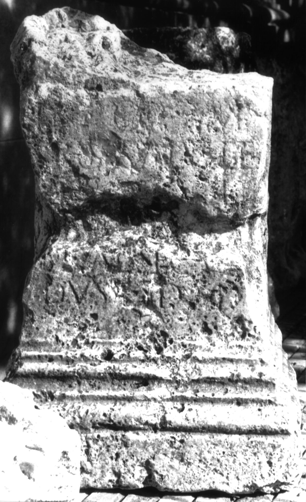

# EDH HD038254. Apulum

**Країна.** Румунія

**Провінція (код EDH).** Dac

**Місце знахідки (антична назва).** Apulum

**Сучасна назва.** Alba Iulia

**Координати.** 46.0669444,23.569999999

**Зберігання.** Alba Iulia, Muz. Unirii

**Датування (роки, від'ємні до н. е.).** 151 … 270

**Матеріал.** Kalkstein

**Тип пам'ятки.** Altar?

**Розміри (висота, ширина, глибина, см).** -98.0 × 50.0 × 30.0

## Текст (латинь, скорочення розкрито)

```
I(ovi) O(ptimo) M(aximo) / [p]ro salute / [---]CII / [------] / C(aius) Val(erius) Secun/dus d(onum) d(edit)
```

## Текст у вихідному записі

```
I O M / [ ]RO SALVTE / [ ]CII / [ ] / C VAL SECVN / DVS D D
```

## Коментар

Altar oder Statuenbasis.

## Література

IDR 3, 5, 172; Zeichnung.
- CIL 03, 01055. #

## Фото



Джерело https://edh.ub.uni-heidelberg.de/edh/inschrift/HD038254, ліцензія CC BY-SA 4.0. Оригінальний XML в архіві сирі_дані/edh_xml.zip
