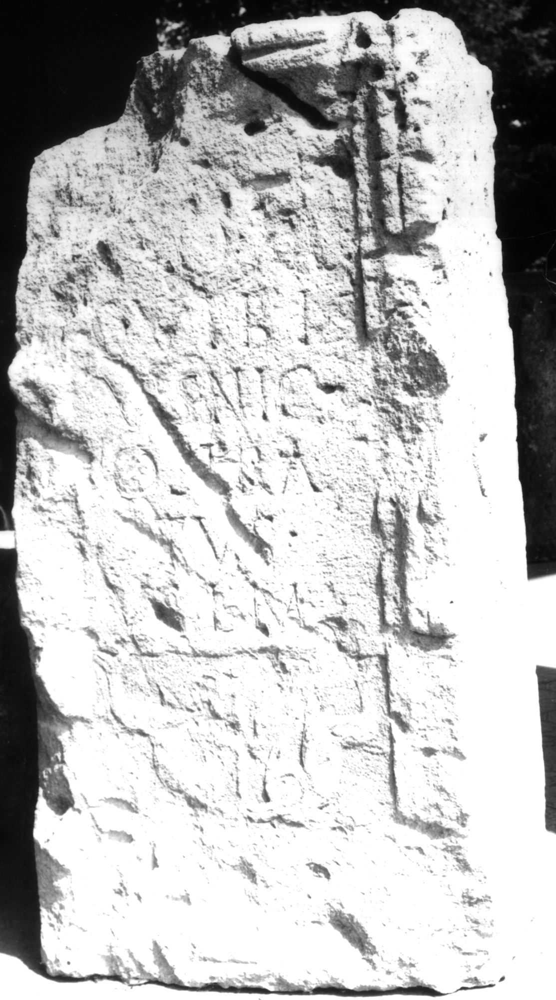
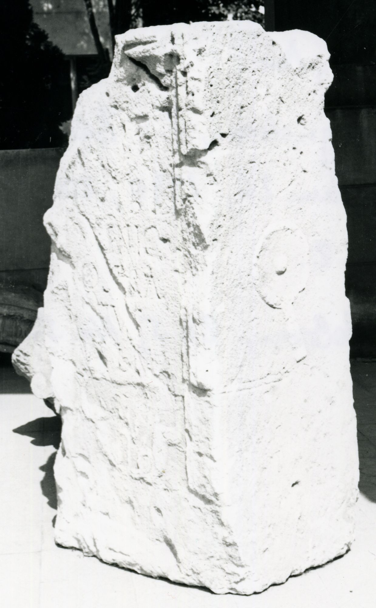

# EDH HD038261. Apulum

**Країна.** Румунія

**Провінція (код EDH).** Dac

**Місце знахідки (антична назва).** Apulum

**Сучасна назва.** Alba Iulia

**Деталі знахідки.** Platoul Romanilor, {Strada Ştefan Cicio-Pop} 1-3

**Координати.** 46.064483886,23.564467085

**Рік знахідки.** 1983

**Зберігання.** Alba Iulia, Muz. Unirii

**Датування (роки, від'ємні до н. е.).** 107 … 150

**Матеріал.** Kalkstein

**Тип пам'ятки.** Altar

**Розміри (висота, ширина, глибина, см).** 117.0 × 57.0 × 45.0

## Текст (латинь, скорочення розкрито)

```
[I(ovi)] O(ptimo) M(aximo) / C(aius) Vibi/us Nic/ostra/tus / v(otum) s(olvit) l(ibens) m(erito)
```

## Текст у вихідному записі

```
[ ] O M / C VIBI / VS NIC / OSTRA / TVS / V S L M
```

## Коментар

Mittelteil eines Altars. (B): Ciugudean - Băluţă, Petolescu, AE 1991: Z. 1.: I(ovi).

## Література

IDR 3, 5, 175; Foto u. Zeichnung.
- AE 1991, 1339. (B)
- H. Ciugudean - C.L. Băluţă, Apulum 26, 1990, 208-209, Nr. 2; fig. 2 (Zeichnung). (B) - AE 1991.
- C.C. Petolescu, StCercIstorV 42, 1991, 265, Nr. 534. (B) - AE 1991. #

## Фото





Джерело https://edh.ub.uni-heidelberg.de/edh/inschrift/HD038261, ліцензія CC BY-SA 4.0. Оригінальний XML в архіві сирі_дані/edh_xml.zip
