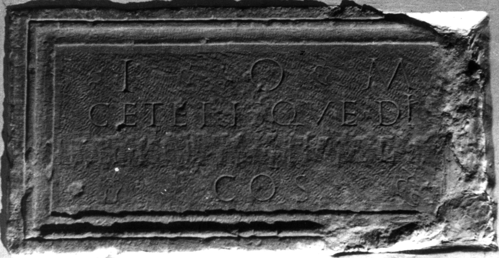

# EDH HD038266. Apulum

**Країна.** Румунія

**Провінція (код EDH).** Dac

**Місце знахідки (антична назва).** Apulum

**Сучасна назва.** Alba Iulia

**Координати.** 46.0669444,23.569999999

**Зберігання.** Wien, Nationalbibl.

**Датування (роки, від'ємні до н. е.).** 182 … 184

**Матеріал.** Kalkstein

**Тип пам'ятки.** Tafel

## Текст (латинь, скорочення розкрито)

```
I(ovi) O(ptimo) M(aximo) / ceterisque diis / [[[C(aius)? Pescennius? Ni]ge[r]?]] / co(n)s(ularis)
```

## Текст у вихідному записі

```
I O M / CETERISQVE DIIS / [[[ ]GE[ ]]] / COS
```

## Коментар

Z. 3: Name eradiert. Z. 1, 2, 4: hederae. Autopsie: Buonopane, 2009.

## Література

IDR 3, 5, 181; Foto u. Zeichnung.
- CIL 03, 01066.
- A. Buonopane - V. La Monaca, in: G.P. Marchi - J. Pál (Hrsg.), Epigrafi romane di Transilvania. Bibliotheca Capitolare di Verona, Manoscritto CCLXVII (Verona - Szeged 2010) 280, Nr. 27; Foto u. Zeichnung.
- F. Beutler - E. Weber (Hrsg.), Die römischen Inschriften der Österreichischen Nationalbibliothek (Wien 2015) 20, Nr. 4; Foto. #

## Фото



Джерело https://edh.ub.uni-heidelberg.de/edh/inschrift/HD038266, ліцензія CC BY-SA 4.0. Оригінальний XML в архіві сирі_дані/edh_xml.zip
