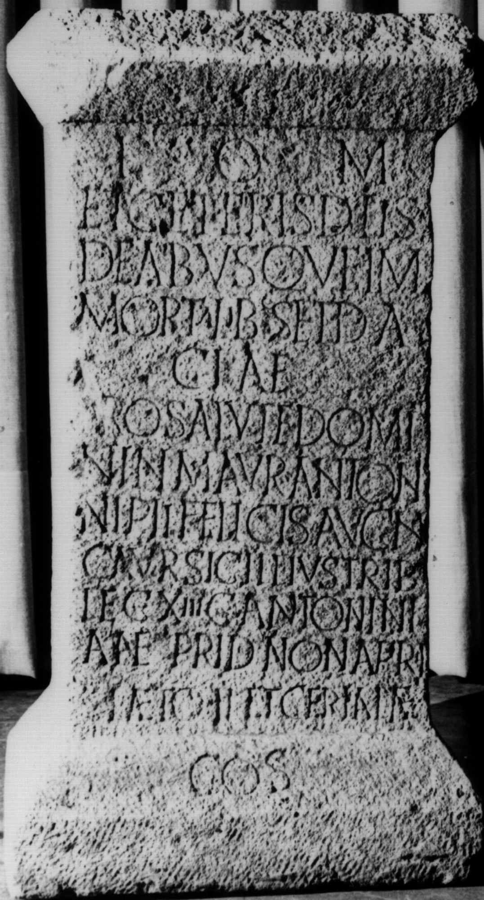

# EDH HD038269. Apulum

**Країна.** Румунія

**Провінція (код EDH).** Dac

**Місце знахідки (антична назва).** Apulum

**Сучасна назва.** Alba Iulia

**Координати.** 46.0669444,23.569999999

**Зберігання.** Alba Iulia, Muz. Unirii

**Датування (роки, від'ємні до н. е.).** 215 … 

**Матеріал.** Kalkstein

**Тип пам'ятки.** Statuenbasis

**Розміри (висота, ширина, глибина, см).** 180.0 × 60.0 × 56.0

## Текст (латинь, скорочення розкрито)

```
I(ovi) O(ptimo) M(aximo) / et ceteris diis / deabusque im/mortalibus et Da/ciae / pro salute domi/ni n(ostri) M(arci) Aur(elii) Antoni/ni Pii Felicis Aug(usti) n(ostri) / C(aius) Aur(elius) Sigillius trib(unus) / leg(ionis) XIII g(eminae) Antonini/anae prid(ie) Non(as) April(es) / Laeto II et Cerialae co(n)s(ulibus)
```

## Текст у вихідному записі

```
I O M / ET CETERIS DIIS / DEABVSQVE IM / MORTALIBVS ET DA / CIAE / PRO SALVTE DOMI / NI N M AVR ANTONI / NI PII FELICIS AVG N / C AVR SIGILLIVS TRIB / LEG XIII G ANTONINI / ANAE PRID NON APRIL / LAETO II ET CERIALAE COS
```

## Література

IDR 3, 5, 184; Foto u. Zeichnung.
- CIL 03, 01063.
- ILS 3922.
- PIR (2. Aufl.) M 54.
- PIR (2. Aufl.) M 735. #

## Фото



Джерело https://edh.ub.uni-heidelberg.de/edh/inschrift/HD038269, ліцензія CC BY-SA 4.0. Оригінальний XML в архіві сирі_дані/edh_xml.zip
