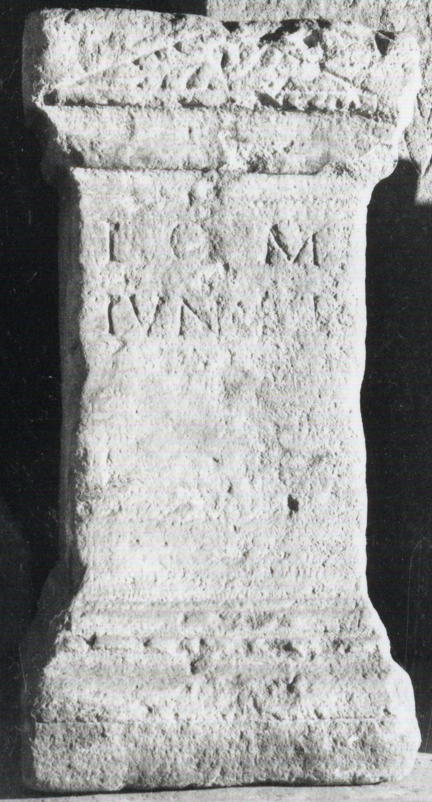

# EDH HD038278. Apulum

**Країна.** Румунія

**Провінція (код EDH).** Dac

**Місце знахідки (антична назва).** Apulum

**Сучасна назва.** Alba Iulia

**Координати.** 46.0669444,23.569999999

**Рік знахідки.** 1924

**Зберігання.** Alba Iulia, Muz. Unirii

**Датування (роки, від'ємні до н. е.).** 131 … 250

**Матеріал.** Kalkstein

**Тип пам'ятки.** Statuenbasis

**Розміри (висота, ширина, глибина, см).** 61.0 × 31.0 × 26.0

## Текст (латинь, скорочення розкрито)

```
I(ovi) O(ptimo) M(aximo) / Iun(oni) Reg(inae)
```

## Текст у вихідному записі

```
I O M / IVN REG
```

## Коментар

Text befindet sich auf den oberen Teil des Inschriftfeldes, urprünglich möglicherweise unvollständig geschrieben.

## Література

IDR 3, 5, 189; Foto u. Zeichnung. #

## Фото



Джерело https://edh.ub.uni-heidelberg.de/edh/inschrift/HD038278, ліцензія CC BY-SA 4.0. Оригінальний XML в архіві сирі_дані/edh_xml.zip
