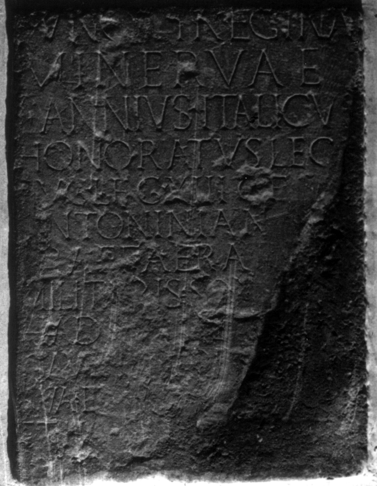

# EDH HD038288. Apulum

**Країна.** Румунія

**Провінція (код EDH).** Dac

**Місце знахідки (антична назва).** Apulum

**Сучасна назва.** Alba Iulia

**Деталі знахідки.** Festung, {S. Michael, katholische Kathedrale}

**Координати.** 46.067648088,23.569900989

**Зберігання.** Wien, Nationalbibl.

**Датування (роки, від'ємні до н. е.).** 215 … 217

**Матеріал.** Kalkstein

**Тип пам'ятки.** Altar?

## Текст (латинь, скорочення розкрито)

```
[I(ovi) O(ptimo) M(aximo)] // Iunoni Reginae / Minervae / L(ucius) Annius Italicus / Honoratus leg(atus) / Aug(usti) leg(ionis) XIII gem(inae) / Antoninianae / praef(ectus) aerarii / militaris sodalis / Hadrianalis cum / Gavidia Torquata / sua et Anniis Italico / et Honorato et / Italica filiis
```

## Текст у вихідному записі

```
[ ] / / IVNONI REGINAE / MINERVAE / L ANNIVS ITALICVS / HONORATVS LEG / AVG LEG XIII GEM / ANTONINIANAE / PRAEF AERARII / MILITARIS SODALIS / HADRIANALIS CVM / GAVIDIA TORQVATA / SVA ET ANNIIS ITALICO / ET HONORATO ET / ITALICA FILIIS
```

## Коментар

Altar oder Statuenbasis. Oberer und unterer rechter Teil des Inschriftfeldes heute nicht erhalten. Z. 14 (Ende): hedera. Autopsie: Buonopane, 2009.

## Література

IDR 3, 5, 195; Foto u. Zeichnung.
- CIL 03, 01071.
- PIR (2. Aufl.) A 659.
- A. Buonopane - V. La Monaca, in: G.P. Marchi - J. Pál (Hrsg.), Epigrafi romane di Transilvania. Bibliotheca Capitolare di Verona, Manoscritto CCLXVII (Verona - Szeged 2010) 299, Nr. 46; Foto u. Zeichnung.
- F. Beutler - E. Weber (Hrsg.), Die römischen Inschriften der Österreichischen Nationalbibliothek (Wien 2015) 20, Nr. 14; Foto. #

## Фото



Джерело https://edh.ub.uni-heidelberg.de/edh/inschrift/HD038288, ліцензія CC BY-SA 4.0. Оригінальний XML в архіві сирі_дані/edh_xml.zip
