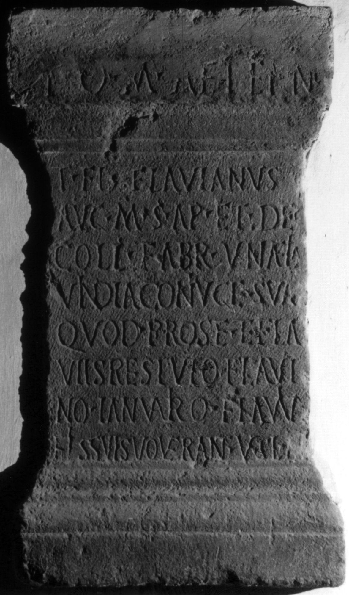

# EDH HD038303. Apulum

**Країна.** Румунія

**Провінція (код EDH).** Dac

**Місце знахідки (антична назва).** Apulum

**Сучасна назва.** Alba Iulia

**Координати.** 46.0669444,23.569999999

**Зберігання.** Wien, Nationalbibl.

**Датування (роки, від'ємні до н. е.).** 197 … 275

**Матеріал.** Kalkstein

**Тип пам'ятки.** Altar?

**Розміри (висота, ширина, глибина, см).** 107.0 × 54.0

## Текст (латинь, скорочення розкрито)

```
I(ovi) O(ptimo) M(aximo) Aeterno // T(itus) Fl(avius) Flavianus / Aug(ustalis) m(unicipii) S(eptimii) Ap(ulensis) et dec(urio) / coll(egii) fabr(um) un(a? cum?) Aelia / Vindia coniuge sua / quod pro se et Fla/viis Restuto Flavi/no Ianuario Flaviano / fi(li)is suis vovetant v(otum) s(olverunt) l(ibentes) m(erito)
```

## Текст у вихідному записі

```
I O M AETERNO / / T FL FLAVIANVS / AVG M S AP ET DEC / COLL FABR VN AELIA / VINDIA CONIVGE SVA / QVOD PRO SE ET FLA / VIIS RESTVTO FLAVI / NO IANVARIO FLAVIANO / FIIS SVIS VOVETANT V S L M
```

## Коментар

Altar oder Statuenbasis. Z. 1 befindet sich auf der Bekrönung. Autopsie: Buonopane, 2009.

## Література

IDR 3, 5, 203; Foto.
- CIL 03, 01082.
- A. Buonopane - V. La Monaca, in: G.P. Marchi - J. Pál (Hrsg.), Epigrafi romane di Transilvania. Bibliotheca Capitolare di Verona, Manoscritto CCLXVII (Verona - Szeged 2010) 273, Nr. 20; Foto u. Zeichnung.
- F. Beutler - E. Weber (Hrsg.), Die römischen Inschriften der Österreichischen Nationalbibliothek (Wien 2015) 42, Nr. 25; Foto. #

## Фото



Джерело https://edh.ub.uni-heidelberg.de/edh/inschrift/HD038303, ліцензія CC BY-SA 4.0. Оригінальний XML в архіві сирі_дані/edh_xml.zip
