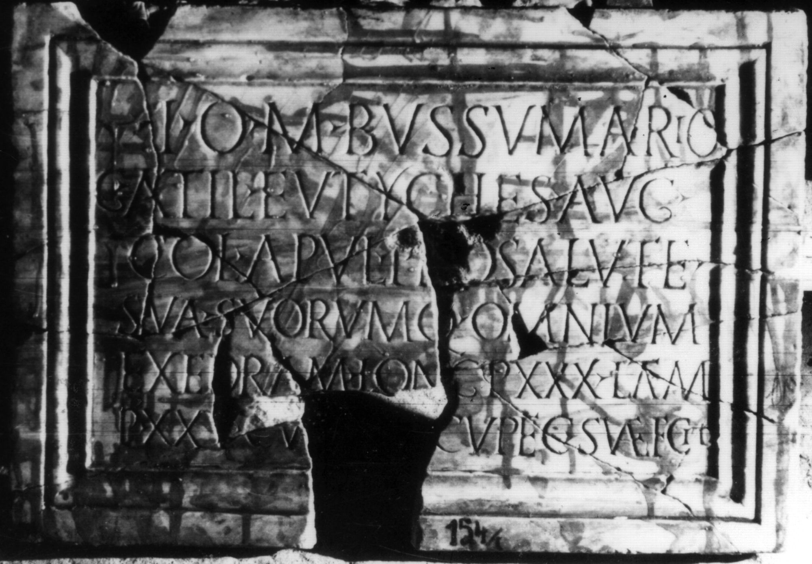

# EDH HD038305. Apulum

**Країна.** Румунія

**Провінція (код EDH).** Dac

**Місце знахідки (антична назва).** Apulum

**Сучасна назва.** Alba Iulia

**Деталі знахідки.** {Partoş}

**Координати.** 46.0463184,23.566650100

**Зберігання.** Alba Iulia, Muz. Unirii

**Датування (роки, від'ємні до н. е.).** 180 … 250

**Матеріал.** Marmor

**Тип пам'ятки.** Tafel

**Розміри (висота, ширина, глибина, см).** 45.0 × 66.5 × 3.0

## Текст (латинь, скорочення розкрито)

```
I(ovi) O(ptimo) M(aximo) Bussumario / G(aius) Atil(ius) Eutyches Aug(ustalis) / col(oniae) Apul(ensis) pro salute / sua suorumq(ue) omnium / exedram long(am) p(edes) XXX latam / p(edes) XXV cu[m ar]cu pec(unia) sua{e} f<e>cit
```

## Текст у вихідному записі

```
I O M BVSSVMARIO / G ATIL EVTYCHES AVG / COL APVL PRO SALVTE / SVA SVORVMQ OMNIVM / EXEDRAM LONG P XXX LATAM / P XXV CV[ ]CV PEC SVAE FCIT
```

## Коментар

Zahlreiche aneinanderpassende Fragmente erhalten. Zeilenlinien für die Beschriftung. (B): CIL III; ILS; Jung; AE 1896: kleinere Abweichungen in der Lesung.

## Література

AE 1896, 0059. (B)
- AE 1897, 0074.
- CIL 03, 14215, 15. (B)
- ILS 4621. (B)
- IDR 3, 5, 206; Foto u. Zeichnung.
- J. Jung, AEM 19, 1896/97, 70, Nr. 2. (B) - AE 1896.
- C. Béla, AErt 16, 1896, 261-262; Foto. - AE 1897. #

## Фото



Джерело https://edh.ub.uni-heidelberg.de/edh/inschrift/HD038305, ліцензія CC BY-SA 4.0. Оригінальний XML в архіві сирі_дані/edh_xml.zip
