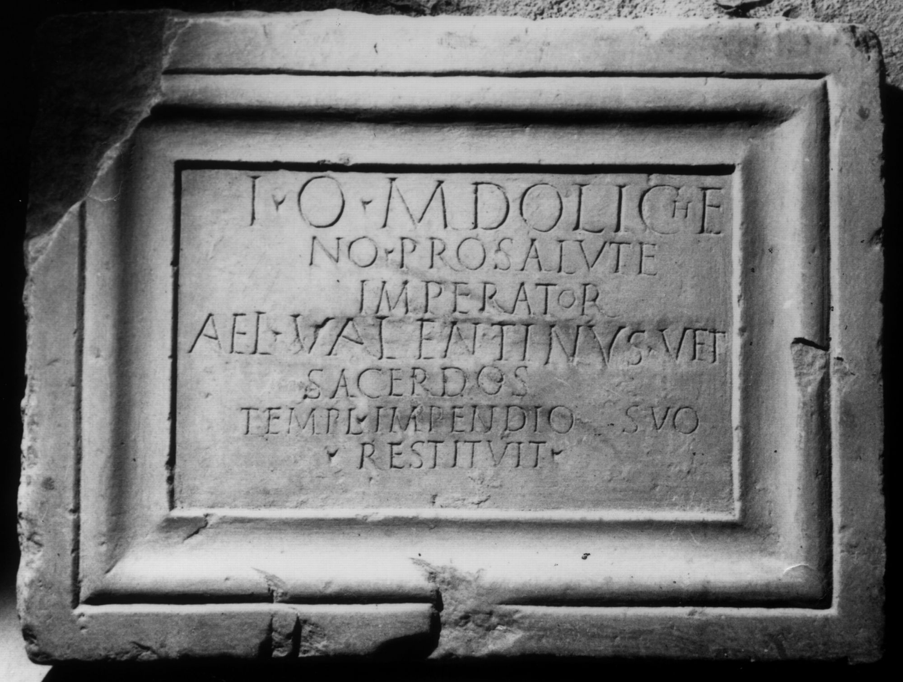

# EDH HD038325. Apulum, aus?

**Країна.** Румунія

**Провінція (код EDH).** Dac

**Місце знахідки (антична назва).** Apulum, aus?

**Сучасна назва.** Sântimbru

**Деталі знахідки.** {Coşlariu}

**Координати.** 46.1571,23.686500000

**Зберігання.** Aiud, Muz. Ist.

**Датування (роки, від'ємні до н. е.).** 231 … 270

**Матеріал.** Marmor

**Тип пам'ятки.** Tafel

**Розміри (висота, ширина, глибина, см).** 60.0 × 45.0 × 8.0

## Текст (латинь, скорочення розкрито)

```
I(ovi) O(ptimo) M(aximo) Doliche/no pro salute / Imperator(um?) / Ael(ius) Valentinus vet(eranus) / sacerdos / templ(um) impendio suo / restituit
```

## Текст у вихідному записі

```
I O M DOLICHE / NO PRO SALVTE / IMPERATOR / AEL VALENTINVS VET / SACERDOS / TEMPL IMPENDIO SVO / RESTITVIT
```

## Коментар

Z. 3: Imperator(is) oder Imperator(um). Z. 4: Valentinus steht auf Rasur.

## Література

IDR 3, 5, 217; Foto.
- CIL 03, 07760.
- C.C. Petolescu, in: A. Vigourt - X. Loriot - A. Bérenger-Badel - B. Klein (Hrsg.), Pouvoir et religion dans le monde romain en hommage à Jean-Pierre Martin (Paris 2006) 462, Nr. 2. - AE 2006.
- AE 2006, 1125.
- CCID 156. #

## Фото



Джерело https://edh.ub.uni-heidelberg.de/edh/inschrift/HD038325, ліцензія CC BY-SA 4.0. Оригінальний XML в архіві сирі_дані/edh_xml.zip
