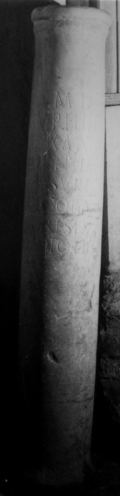
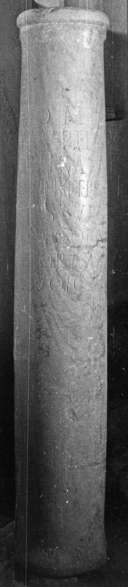

# EDH HD038327. Apulum

**Країна.** Румунія

**Провінція (код EDH).** Dac

**Місце знахідки (антична назва).** Apulum

**Сучасна назва.** Alba Iulia

**Деталі знахідки.** {Partoş}

**Координати.** 46.0463184,23.566650100

**Зберігання.** Sebeş, Muzeul

**Датування (роки, від'ємні до н. е.).** 211 … 275

**Матеріал.** Marmor

**Тип пам'ятки.** EhrenVotivsäule

**Розміри (висота, ширина, глибина, см).** 180.0 × 28.0

## Текст (латинь, скорочення розкрито)

```
I(ovi) O(ptimo) M(aximo) D(olicheno) / Aurelii / Alexan/der et Fla/(v)us Suri / negotia/tores ex / voto l(ibentes) p(osuerunt)
```

## Текст у вихідному записі

```
I O M D / AVRELII / ALEXAN / DER ET FLA / VS SVRI / NEGOTIA / TORES EX / VOTO L P
```

## Коментар

Säulenschaft.

## Література

IDR 3, 5, 218; Foto.
- CIL 03, 07761.
- ILS 4304. #

## Фото





Джерело https://edh.ub.uni-heidelberg.de/edh/inschrift/HD038327, ліцензія CC BY-SA 4.0. Оригінальний XML в архіві сирі_дані/edh_xml.zip
