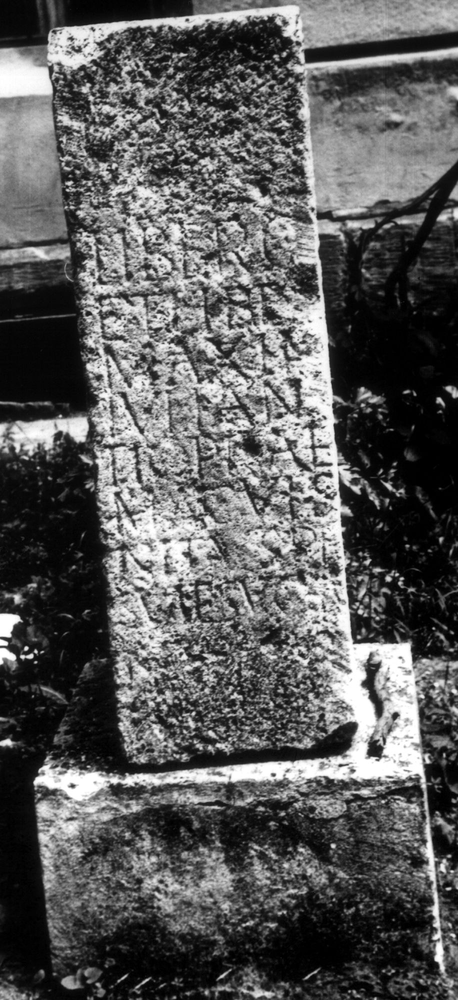

# EDH HD038363. Apulum

**Країна.** Румунія

**Провінція (код EDH).** Dac

**Місце знахідки (антична назва).** Apulum

**Сучасна назва.** Alba Iulia

**Деталі знахідки.** Festung, {Prinzenpalast}

**Координати.** 46.066702723,23.570780754

**Зберігання.** Alba Iulia, Muz. Unirii

**Датування (роки, від'ємні до н. е.).** 168 … 275

**Матеріал.** Kalkstein

**Тип пам'ятки.** Altar?

**Розміри (висота, ширина, глибина, см).** -99.0 × -32.0 × -47.0

## Текст (латинь, скорочення розкрито)

```
Liber(o) Patr(i) / et Liber(a)e C(aius) / Maximius / Iulianus op/tio praet(orii) leg(ionis) V / Mac(edonicae) visu mo/nitus pro sal(ute) / sua et suorum l(ibens) p(osuit)
```

## Текст у вихідному записі

```
LIBER PATR / ET LIBERE C / MAXIMIVS / IVLIANVS OP / TIO PRAET LEG V / MAC VISV MO / NITVS PRO SAL / SVA ET SVORVM L P
```

## Коментар

Altar oder Statuenbasis, in späteren Zeit bearbeitet und wiederverwendet. Inschiftfeld ursprünglich vollständig, heute nur linker Teil erhalten.

## Література

IDR 3, 5, 243; Foto u. Zeichnung.
- CIL 03, 07765.
- CIL 03, 01094.
- ILS 2439. #

## Фото



Джерело https://edh.ub.uni-heidelberg.de/edh/inschrift/HD038363, ліцензія CC BY-SA 4.0. Оригінальний XML в архіві сирі_дані/edh_xml.zip
