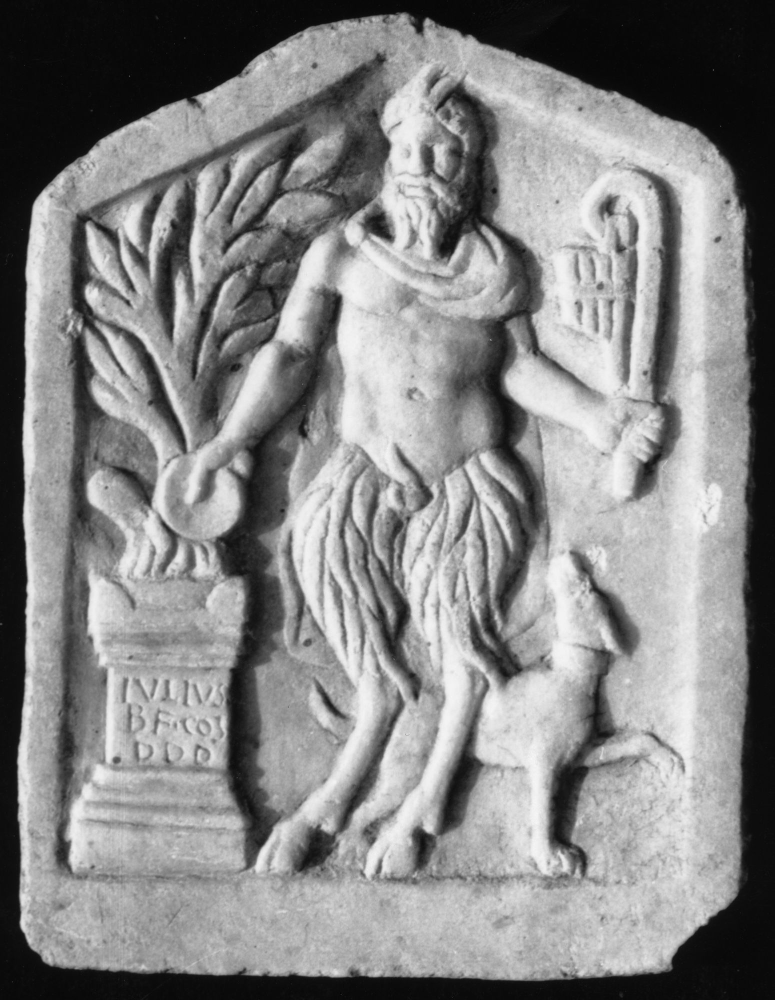

# EDH HD038364. Apulum

**Країна.** Румунія

**Провінція (код EDH).** Dac

**Місце знахідки (антична назва).** Apulum

**Сучасна назва.** Alba Iulia

**Деталі знахідки.** {Partoş}, Tempel des Liber Pater

**Координати.** 46.050245046,23.564944519

**Рік знахідки.** 1989

**Зберігання.** Alba Iulia, Muz. Unirii

**Датування (роки, від'ємні до н. е.).** 201 … 300

**Матеріал.** Marmor

**Тип пам'ятки.** Relief

**Розміри (висота, ширина, глибина, см).** 32.0 × 24.5 × 2.0

## Текст (латинь, скорочення розкрито)

```
Iulius / b(ene)f(iciarius) co(n)s(ularis) / d(onum) d(edit) d(edicavitque)
```

## Текст у вихідному записі

```
IVLIVS / BF COS / D D D
```

## Коментар

Relief mit giebelförmigem Abschluß; Darstellung des opfernden Pan; die Inschrift befindet sich auf dem Mittelteil des im Relief dargestellten Altars.

## Література

IDR 3, 5, 244; Foto.
- A. Schäfer, in: E. Walde - B. Kainrath (Hrsg.), Die Selbstdarstellung der römischen Gesellschaft in den Provinzen im Spiegel der Steindenkmäler.
- IX. Internationalen Kolloquiums über Probleme des provinzialrömischen Kunstschaffens, Innsbruck 2005 (Innsbruck 2007) 63; Abb. 7. #

## Фото



Джерело https://edh.ub.uni-heidelberg.de/edh/inschrift/HD038364, ліцензія CC BY-SA 4.0. Оригінальний XML в архіві сирі_дані/edh_xml.zip
