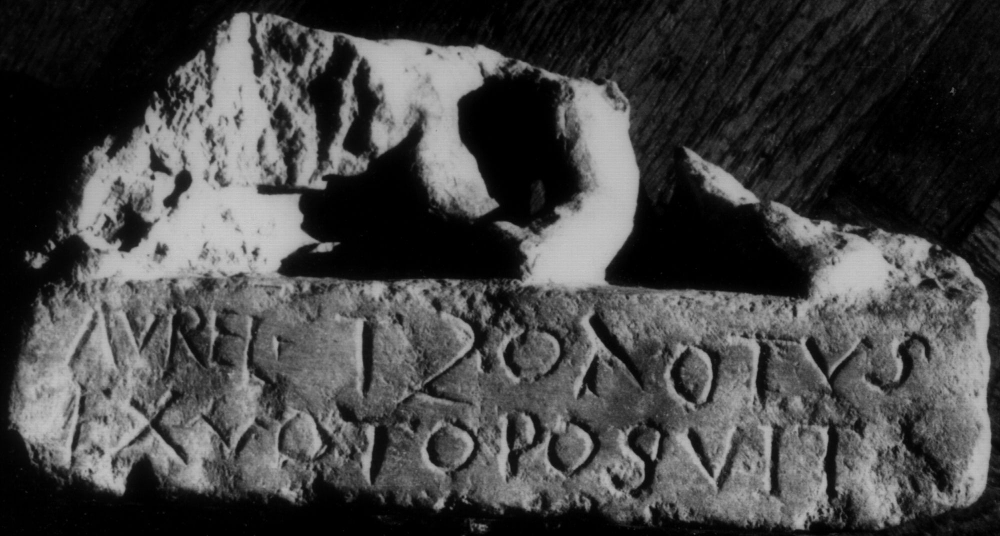

# EDH HD038365. Apulum

**Країна.** Румунія

**Провінція (код EDH).** Dac

**Місце знахідки (антична назва).** Apulum

**Сучасна назва.** Alba Iulia

**Деталі знахідки.** {Partoş}

**Координати.** 46.0463184,23.566650100

**Зберігання.** Cluj-Napoca, Muz. Naţ. Ist. Transilv.

**Датування (роки, від'ємні до н. е.).** 212 … 275

**Матеріал.** Marmor

**Тип пам'ятки.** Relief

**Розміри (висота, ширина, глибина, см).** -11.0 × -20.0 × 7.0

## Текст (латинь, скорочення розкрито)

```
Aurel(ius) Tzolotus(?) / ex voto posuit
```

## Текст у вихідному записі

```
AVREL TZOLOTVS / EX VOTO POSVIT
```

## Коментар

Unterer Teil des Reliefs erhalten. Es handelt sich wahrscheinlich um eine Darstellung von Liber Pater. Inschrift auf der Basis des Reliefs. Unterschiedliche Herkunftsangaben; nach IDR III 5 jedoch wahrscheinlicher aus Partoş (Alba Iulia) als aus Războieni-Cetate (Ocna Mureş).

## Література

IDR 3, 5, 245, Foto.
- CIL 03, 07789.
- IDR 3, 4, 074; fig. 36 (Foto u. Zeichnung). #

## Фото



Джерело https://edh.ub.uni-heidelberg.de/edh/inschrift/HD038365, ліцензія CC BY-SA 4.0. Оригінальний XML в архіві сирі_дані/edh_xml.zip
