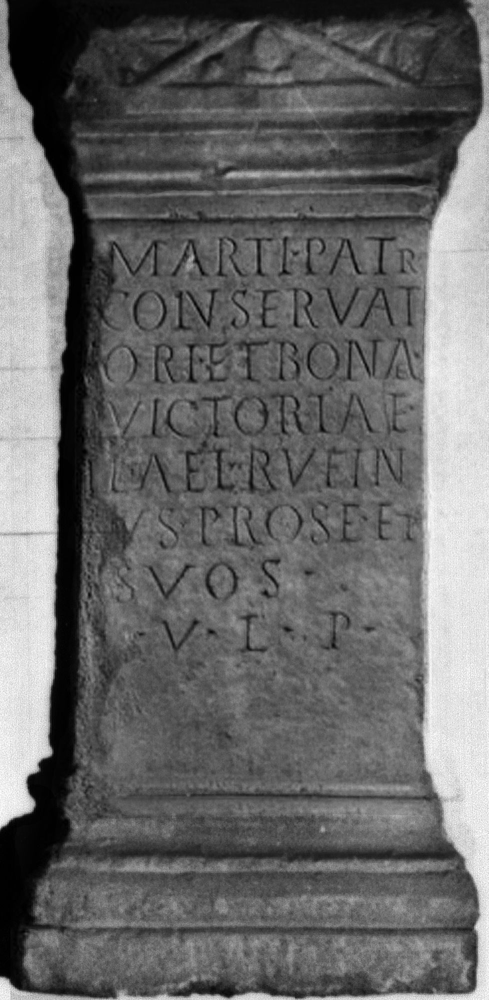

# EDH HD038371. Apulum, aus?

**Країна.** Румунія

**Провінція (код EDH).** Dac

**Місце знахідки (антична назва).** Apulum, aus?

**Сучасна назва.** Petreştii de Jos

**Координати.** 46.580833299,23.655277800

**Зберігання.** Wien, Nationalbibl.

**Датування (роки, від'ємні до н. е.).** 171 … 270

**Матеріал.** Marmor

**Тип пам'ятки.** Altar?

## Текст (латинь, скорочення розкрито)

```
Marti Patr(i) / conservat/ori et bonae / Victoriae / L(ucius)(?) Ael(ius) Rufin/us pro se et / suos / v(oto) l(ibens) p(osuit)
```

## Текст у вихідному записі

```
MARTI PATR / CONSERVAT / ORI ET BONAE / VICTORIAE / L AEL RVFIN / VS PRO SE ET / SVOS / V L P
```

## Коментар

Altar oder Statuenbasis. Autopsie: Buonopane, 2009.

## Література

IDR 3, 5, 251; Foto.
- CIL 03, 01600.
- ILS 3159.
- A. Buonopane - V. La Monaca, in: G.P. Marchi - J. Pál (Hrsg.), Epigrafi romane di Transilvania. Bibliotheca Capitolare di Verona, Manoscritto CCLXVII (Verona - Szeged 2010) 282, Nr. 29; Foto u. Zeichnung.
- F. Beutler - E. Weber (Hrsg.), Die römischen Inschriften der Österreichischen Nationalbibliothek (Wien 2015) 38, Nr. 21; Foto. #

## Фото



Джерело https://edh.ub.uni-heidelberg.de/edh/inschrift/HD038371, ліцензія CC BY-SA 4.0. Оригінальний XML в архіві сирі_дані/edh_xml.zip
