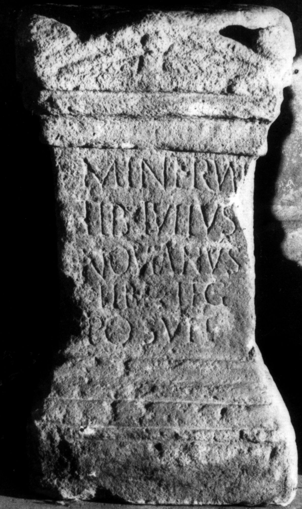

# EDH HD038390. Apulum

**Країна.** Румунія

**Провінція (код EDH).** Dac

**Місце знахідки (антична назва).** Apulum

**Сучасна назва.** Alba Iulia

**Координати.** 46.0669444,23.569999999

**Зберігання.** Alba Iulia, Muz. Unirii

**Датування (роки, від'ємні до н. е.).** 168 … 200

**Матеріал.** Kalkstein

**Тип пам'ятки.** Altar

**Розміри (висота, ширина, глибина, см).** 50.0 × 28.0 × 27.0

## Текст (латинь, скорочення розкрито)

```
Minervae / Tib(erius) Iulius / Novianus / libr(arius) leg(ati) / posuit
```

## Текст у вихідному записі

```
MINERVAE / TIB IVLIVS / NOVIANVS / LIBR LEG / POSVIT
```

## Література

IDR 3, 5, 261; Foto u. Zeichnung.
- CIL 03, 01105.
- CIL 03, 01105 add. p. 1390.
- A. Buonopane - V. La Monaca, in: G.P. Marchi - J. Pál (Hrsg.), Epigrafi romane di Transilvania. Bibliotheca Capitolare di Verona, Manoscritto CCLXVII (Verona - Szeged 2010) 339, Nr. 23; Foto u. Zeichnung. #

## Фото



Джерело https://edh.ub.uni-heidelberg.de/edh/inschrift/HD038390, ліцензія CC BY-SA 4.0. Оригінальний XML в архіві сирі_дані/edh_xml.zip
