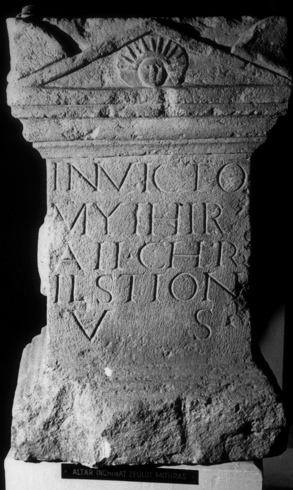

# EDH HD038402. Apulum

**Країна.** Румунія

**Провінція (код EDH).** Dac

**Місце знахідки (антична назва).** Apulum

**Сучасна назва.** Alba Iulia

**Деталі знахідки.** {Partoş}

**Координати.** 46.0463184,23.566650100

**Рік знахідки.** 1852

**Зберігання.** Cluj-Napoca, Muz. Naţ. Ist. Transilv.

**Датування (роки, від'ємні до н. е.).** 151 … 275

**Матеріал.** Kalkstein

**Тип пам'ятки.** Altar

**Розміри (висота, ширина, глибина, см).** 68.0 × 45.0 × 31.0

## Текст (латинь, скорочення розкрито)

```
Invicto / Mythir/ae(!) Chr/estion / v(otum) s(olvit)
```

## Текст у вихідному записі

```
INVICTO / MYTHIR / AE CHR / ESTION / V S
```

## Коментар

Auf der Vorderseite der corona Giebel mit Darstellung dem Kopf des Sol im Giebelfeld. Buchstabe E in Form von II (Z. 3) bzw. irrtümlich IL (Z. 4) geschrieben.

## Література

IDR 3, 5, 272; Foto.
- CIL 03, 01112. #

## Фото



Джерело https://edh.ub.uni-heidelberg.de/edh/inschrift/HD038402, ліцензія CC BY-SA 4.0. Оригінальний XML в архіві сирі_дані/edh_xml.zip
