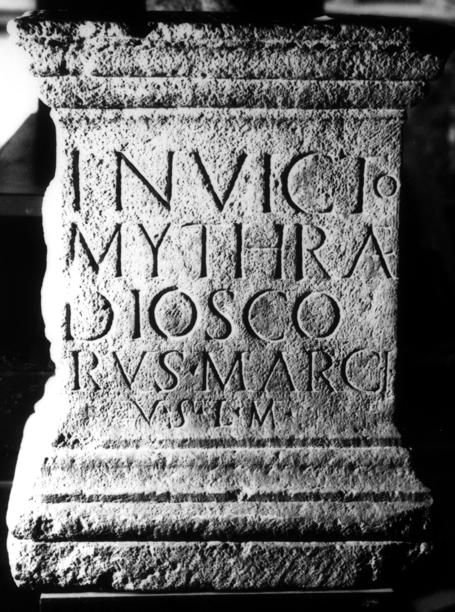

# EDH HD038403. Apulum

**Країна.** Румунія

**Провінція (код EDH).** Dac

**Місце знахідки (антична назва).** Apulum

**Сучасна назва.** Alba Iulia

**Деталі знахідки.** {Partoş}

**Координати.** 46.0463184,23.566650100

**Зберігання.** Bucureşti, Muz. Naţ. Ist. Rom.

**Датування (роки, від'ємні до н. е.).** 107 … 200

**Матеріал.** Kalkstein

**Тип пам'ятки.** Statuenbasis

**Розміри (висота, ширина, глибина, см).** 63.0 × 50.0 × 39.0

## Текст (латинь, скорочення розкрито)

```
Invicto / Mythrae(!) / Diosco/rus Marci / v(otum) s(olvit) l(ibens) m(erito)
```

## Текст у вихідному записі

```
INVICTO / MYTHRAE / DIOSCO / RVS MARCI / V S L M
```

## Література

IDR 3, 5, 273; Foto.
- CIL 03, 01113. #

## Фото



Джерело https://edh.ub.uni-heidelberg.de/edh/inschrift/HD038403, ліцензія CC BY-SA 4.0. Оригінальний XML в архіві сирі_дані/edh_xml.zip
