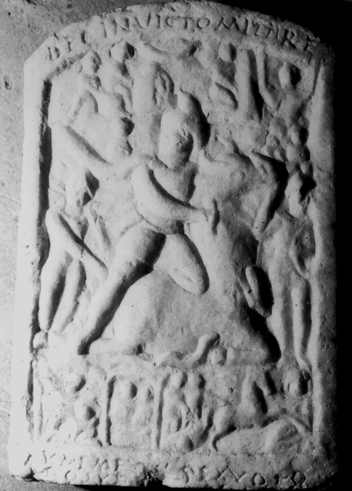

# EDH HD038406. Apulum

**Країна.** Румунія

**Провінція (код EDH).** Dac

**Місце знахідки (антична назва).** Apulum

**Сучасна назва.** Alba Iulia

**Координати.** 46.0669444,23.569999999

**Зберігання.** Alba Iulia, Muz. Unirii

**Датування (роки, від'ємні до н. е.).** 151 … 250

**Матеріал.** Marmor

**Тип пам'ятки.** Relief

**Розміри (висота, ширина, глибина, см).** 33.0 × 23.0 × 4.5

## Текст (латинь, скорочення розкрито)

```
Deo invicto Mithr(a)e // Euhemerus ex voto / posuit
```

## Текст у вихідному записі

```
DEO INVICTO MITHRE / / EVHEMERVS EX VOTO / POSVIT
```

## Коментар

Mithrasrelief in drei Szenen. Inschrift befindet sich auf den Rahmen des Reliefs.

## Література

IDR 3, 5, 274; Foto u. Zeichnung.
- CIL 03, 01120. #

## Фото



Джерело https://edh.ub.uni-heidelberg.de/edh/inschrift/HD038406, ліцензія CC BY-SA 4.0. Оригінальний XML в архіві сирі_дані/edh_xml.zip
