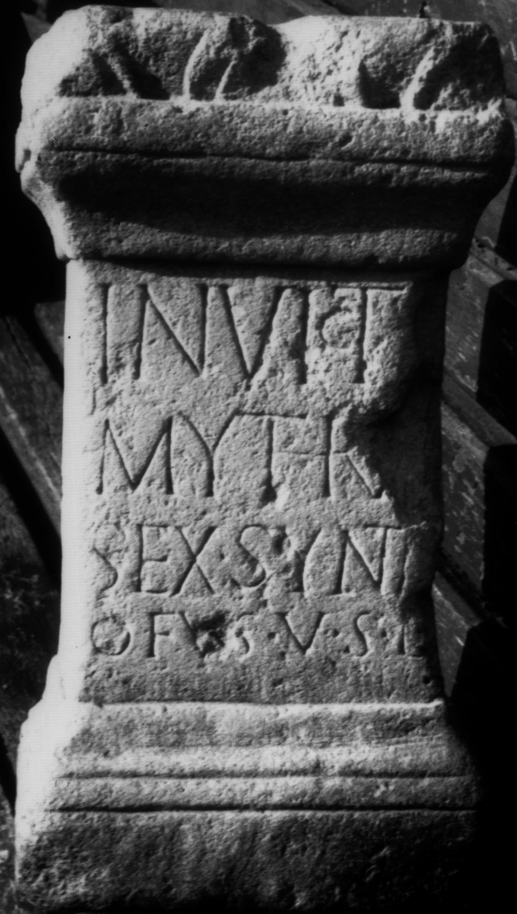

# EDH HD038414. Apulum

**Країна.** Румунія

**Провінція (код EDH).** Dac

**Місце знахідки (антична назва).** Apulum

**Сучасна назва.** Alba Iulia

**Деталі знахідки.** {Partoş}

**Координати.** 46.0463184,23.566650100

**Зберігання.** Sighişoara, Muzeul

**Датування (роки, від'ємні до н. е.).** 171 … 275

**Матеріал.** Gesteine

**Тип пам'ятки.** Altar?

**Розміри (висота, ширина, глибина, см).** 46.0 × 23.0 × 20.0

## Текст (латинь, скорочення розкрито)

```
Invict[o] / Mythra[e] / Sex(tius?) Syntr/ofus v(otum) s(olvit) l(ibens)
```

## Текст у вихідному записі

```
INVICT[ ] / MYTHRA[ ] / SEX SYNTR / OFVS V S L
```

## Коментар

Altar oder Statuenbasis.

## Література

IDR 3, 5, 277; Foto u. Zeichnung.
- CIL 03, 07777. #

## Фото



Джерело https://edh.ub.uni-heidelberg.de/edh/inschrift/HD038414, ліцензія CC BY-SA 4.0. Оригінальний XML в архіві сирі_дані/edh_xml.zip
