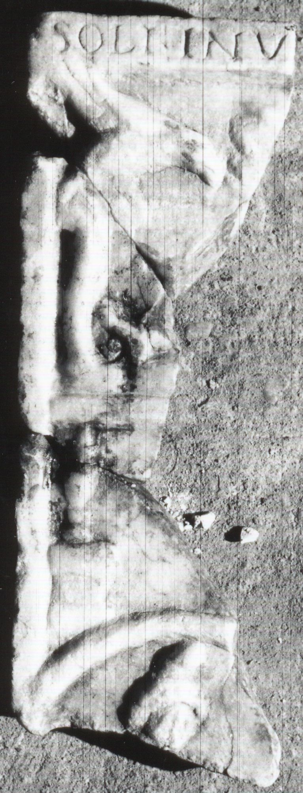

# EDH HD038415. Apulum

**Країна.** Румунія

**Провінція (код EDH).** Dac

**Місце знахідки (антична назва).** Apulum

**Сучасна назва.** Alba Iulia

**Координати.** 46.0669444,23.569999999

**Зберігання.** Alba Iulia, Muz. Unirii

**Датування (роки, від'ємні до н. е.).** 151 … 275

**Матеріал.** Marmor

**Тип пам'ятки.** Relief

**Розміри (висота, ширина, глибина, см).** -27.0 × -9.5 × 3.0

## Текст (латинь, скорочення розкрито)

```
Soli Invi[cto Mithrae ---?] // [&?
```

## Текст у вихідному записі

```
SOLI INVI[ ] / / [
```

## Коментар

Drei aneinanderpassende Fragmente vom linken Teil eines Mithrasreliefs. Die Inschrift befindet sich auf dem oberen Rahmen. Unter der Inschrift Rest eines Bildfeldes mit einer Kline, darunter Kopf einer Mithrasfigur erhalten.

## Література

IDR 3, 5, 278; Foto.
- CIMRM 1979; fig. 516.
- CIMRM 1980; fig. 516. #

## Фото



Джерело https://edh.ub.uni-heidelberg.de/edh/inschrift/HD038415, ліцензія CC BY-SA 4.0. Оригінальний XML в архіві сирі_дані/edh_xml.zip
