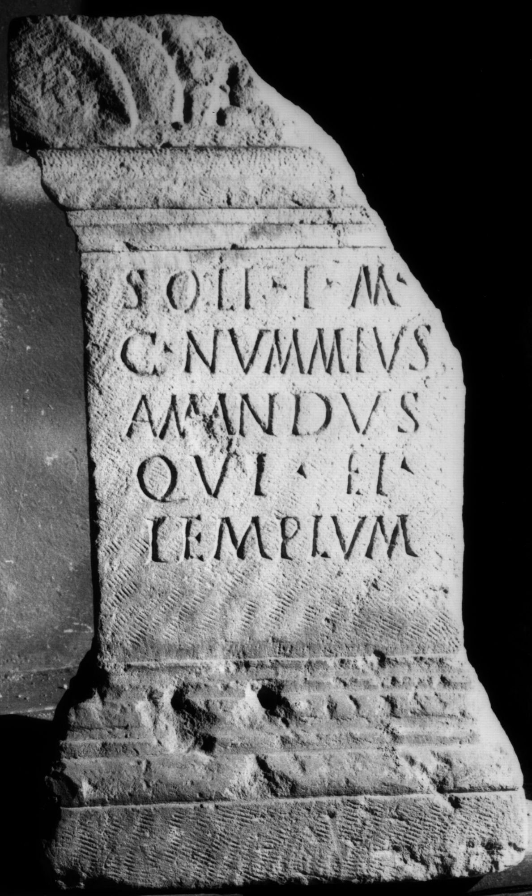
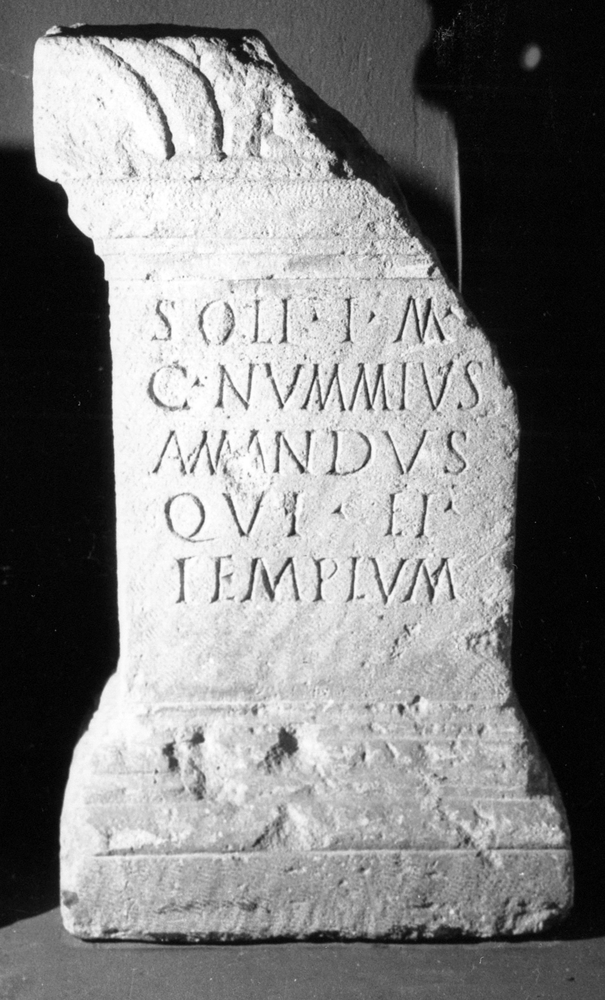

# EDH HD038423. Apulum

**Країна.** Румунія

**Провінція (код EDH).** Dac

**Місце знахідки (антична назва).** Apulum

**Сучасна назва.** Alba Iulia

**Деталі знахідки.** Friedhof

**Координати.** 46.0669444,23.569999999

**Зберігання.** Sibiu, Muz. Brukenthal

**Датування (роки, від'ємні до н. е.).** 171 … 270

**Матеріал.** Kalkstein

**Тип пам'ятки.** Altar?

**Розміри (висота, ширина, глибина, см).** 77.0 × -43.0 × 23.0

## Текст (латинь, скорочення розкрито)

```
Soli I(nvicto) M(ithrae) / C(aius) Nummius / Amandus / qui et / templum
```

## Текст у вихідному записі

```
SOLI I M / C NVMMIVS / AMANDVS / QVI ET / TEMPLVM
```

## Коментар

Altar oder Statuenbasis.

## Література

IDR 3, 5, 283; Foto.
- CIL 03, 07776. #

## Фото





Джерело https://edh.ub.uni-heidelberg.de/edh/inschrift/HD038423, ліцензія CC BY-SA 4.0. Оригінальний XML в архіві сирі_дані/edh_xml.zip
