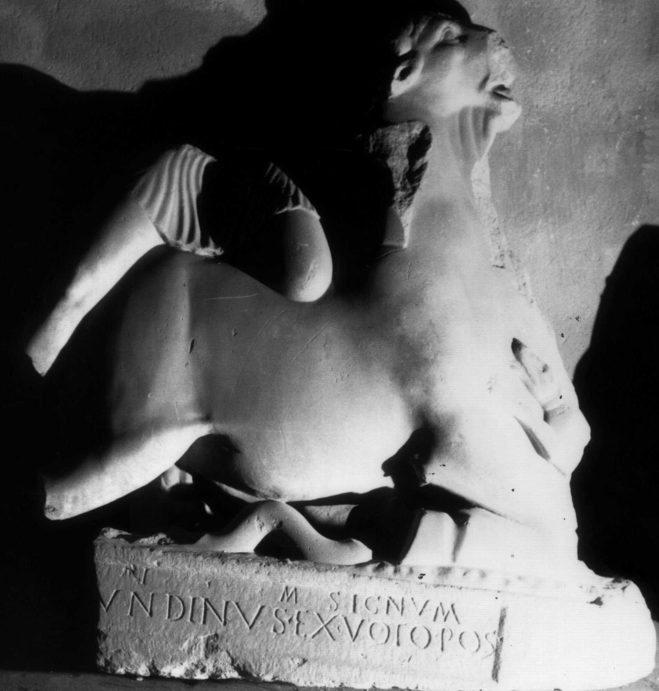

# EDH HD038424. Apulum

**Країна.** Румунія

**Провінція (код EDH).** Dac

**Місце знахідки (антична назва).** Apulum

**Сучасна назва.** Alba Iulia

**Деталі знахідки.** {Partoş}

**Координати.** 46.0463184,23.566650100

**Рік знахідки.** -1800

**Зберігання.** Sibiu, Muz. Brukenthal

**Датування (роки, від'ємні до н. е.).** 131 … 200

**Матеріал.** Marmor

**Тип пам'ятки.** Statuenbasis

**Розміри (висота, ширина, глибина, см).** -108.0 × -108.0 × 30.0

## Текст (латинь, скорочення розкрито)

```
[S(oli)?] I(nvicto) M(ithrae) signum / [--- Sec]undinus ex voto pos(uit)
```

## Текст у вихідному записі

```
[ ] I M SIGNVM / [ ]VNDINVS EX VOTO POS
```

## Коментар

Statue des stiertötenden Mithras mit angearbeiteter Basis und eingetieftem Inschriftfeld; Maße beziehen sich auf das gesamte Monument.

## Література

IDR 3, 5, 284; Foto u. Zeichnung.
- CIL 03, 01123.
- A. Schäfer, in: E. Walde - B. Kainrath (Hrsg.), Die Selbstdarstellung der römischen Gesellschaft in den Provinzen im Spiegel der Steindenkmäler.
- IX. Internationales Kolloquium über Probleme des provinzialrömischen Kunstschaffens, Innsbruck 2005 (Innsbruck 2007) 60-61; Abb. 5.
- CIMRM 1947.
- CIMRM 1948. #

## Фото



Джерело https://edh.ub.uni-heidelberg.de/edh/inschrift/HD038424, ліцензія CC BY-SA 4.0. Оригінальний XML в архіві сирі_дані/edh_xml.zip
