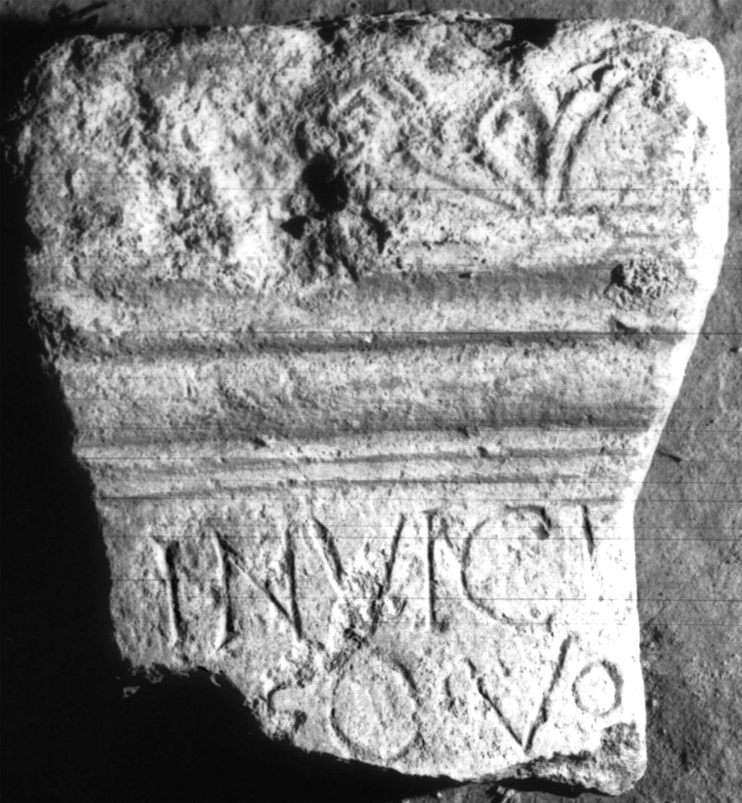

# EDH HD038428. Apulum

**Країна.** Румунія

**Провінція (код EDH).** Dac

**Місце знахідки (антична назва).** Apulum

**Сучасна назва.** Alba Iulia

**Координати.** 46.0669444,23.569999999

**Зберігання.** Alba Iulia, Muz. Unirii

**Датування (роки, від'ємні до н. е.).** 201 … 275

**Матеріал.** Kalkstein

**Тип пам'ятки.** Altar?

**Розміри (висота, ширина, глибина, см).** -23.0 × -22.0 × -13.0

## Текст (латинь, скорочення розкрито)

```
Invict[o] / [D]eo vo/[tum? sol(vit)?] / [&
```

## Текст у вихідному записі

```
INVICT[ ] / [ ]EO VO / [ ] / [
```

## Коментар

Altar oder Statuenbasis. Unterer Teil nicht erhalten.

## Література

IDR 3, 5, 287; Foto u. Zeichnung. #

## Фото



Джерело https://edh.ub.uni-heidelberg.de/edh/inschrift/HD038428, ліцензія CC BY-SA 4.0. Оригінальний XML в архіві сирі_дані/edh_xml.zip
