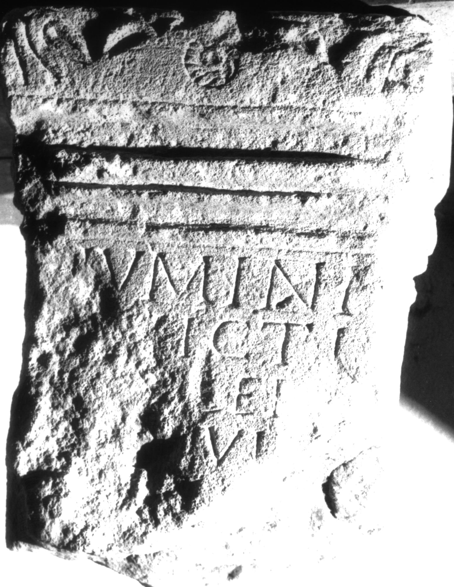

# EDH HD038430. Apulum

**Країна.** Румунія

**Провінція (код EDH).** Dac

**Місце знахідки (антична назва).** Apulum

**Сучасна назва.** Alba Iulia

**Деталі знахідки.** Carolina, {Mithraeum}

**Координати.** 46.062935988,23.567095398

**Зберігання.** Alba Iulia, Muz. Unirii

**Датування (роки, від'ємні до н. е.).** 171 … 200

**Матеріал.** Kalkstein

**Тип пам'ятки.** Altar?

**Розміри (висота, ширина, глибина, см).** -35.5 × -27.5 × 18.0

## Текст (латинь, скорочення розкрито)

```
Numini / [in]victi / [- Va?]ler(ius) / [---]viu[s] / [---]P(?)[--] / [&
```

## Текст у вихідному записі

```
NVMINI / [ ]VICTI / [ ]LER / [ ]VIV[ ] / [ ]P[ ] / [
```

## Коментар

Altar oder Statuenbasis.

## Література

IDR 3, 5, 288; Foto u. Zeichnung. #

## Фото



Джерело https://edh.ub.uni-heidelberg.de/edh/inschrift/HD038430, ліцензія CC BY-SA 4.0. Оригінальний XML в архіві сирі_дані/edh_xml.zip
