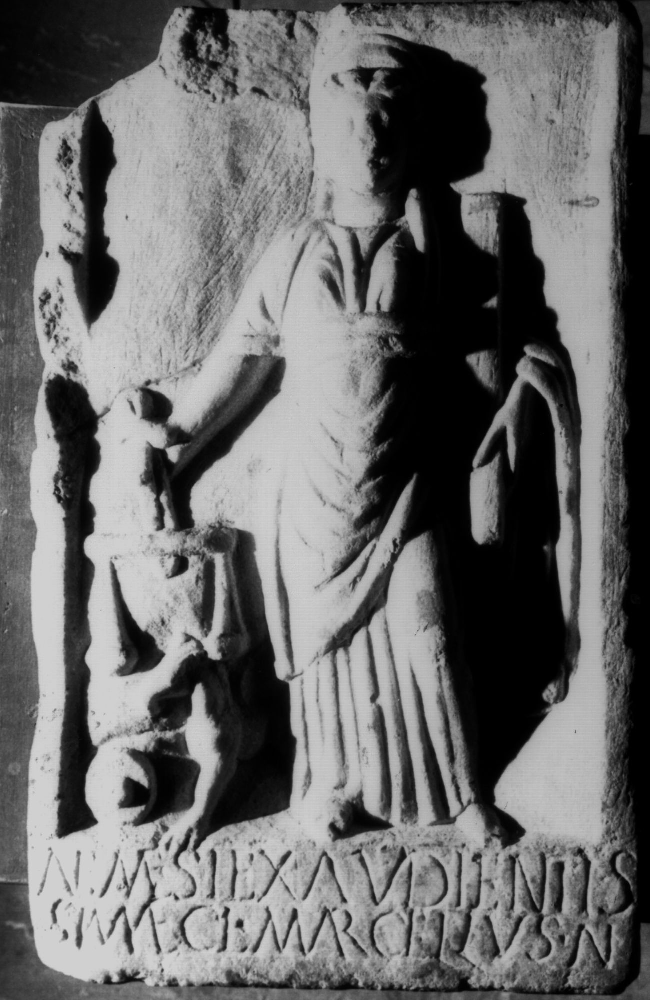

# EDH HD038481. Apulum

**Країна.** Румунія

**Провінція (код EDH).** Dac

**Місце знахідки (антична назва).** Apulum

**Сучасна назва.** Alba Iulia

**Деталі знахідки.** Festung, {Batthyaneum}

**Координати.** 46.070491530,23.570681512

**Зберігання.** Alba Iulia, Muz. Unirii

**Датування (роки, від'ємні до н. е.).** 171 … 270

**Матеріал.** Marmor

**Тип пам'ятки.** Relief

**Розміри (висота, ширина, глибина, см).** 37.0 × 23.0 × 3.5

## Текст (латинь, скорочення розкрито)

```
Nemesi exaudientis/simae Cl(audius) Marcellus Au(gustalis)
```

## Текст у вихідному записі

```
NEMESI EXAVDIENTIS / SIMAE CL MARCELLVS AV
```

## Коментар

Darstellung von Nemesis, mit meta, Waage und Greif. Inschrift befindet sich auf der Basis des Reliefs.

## Література

IDR 3, 5, 296; Foto u. Zeichnung.
- CIL 03, 01126.
- ILS 3744. #

## Фото



Джерело https://edh.ub.uni-heidelberg.de/edh/inschrift/HD038481, ліцензія CC BY-SA 4.0. Оригінальний XML в архіві сирі_дані/edh_xml.zip
