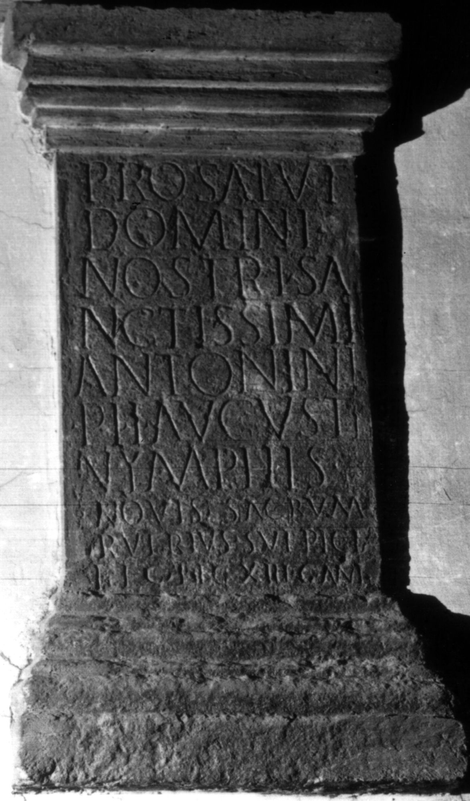

# EDH HD038487. Apulum

**Країна.** Румунія

**Провінція (код EDH).** Dac

**Місце знахідки (антична назва).** Apulum

**Сучасна назва.** Alba Iulia

**Деталі знахідки.** Festung, S. Andreas, Kirche

**Координати.** 46.068697134,23.574090851

**Зберігання.** Wien, Nationalbibl.

**Датування (роки, від'ємні до н. е.).** 212 … 215

**Тип пам'ятки.** Altar?

**Розміри (висота, ширина, глибина, см).** 107.0 × 57.0

## Текст (латинь, скорочення розкрито)

```
Pro salut(e) / domini / nostri sa/nctissimi / Antonini / Pii Augusti / Nymphis / novis sacrum / Rufrius Sulpicia(nus) / leg(atus) leg(ionis) XIII g(eminae) Ant(oninianae)
```

## Текст у вихідному записі

```
PRO SALVT / DOMINI / NOSTRI SA / NCTISSIMI / ANTONINI / PII AVGVSTI / NYMPHIS / NOVIS SACRVM / RVFRIVS SVLPICIA / LEG LEG XIII G ANT
```

## Коментар

Altar oder Statuenbasis. Autopsie: Buonopane, 2009.

## Література

IDR 3, 5, 298; Foto u. Zeichnung.
- CIL 03, 01129.
- ILS 3867.
- A. Buonopane - V. La Monaca, in: G.P. Marchi - J. Pál (Hrsg.), Epigrafi romane di Transilvania. Bibliotheca Capitolare di Verona, Manoscritto CCLXVII (Verona - Szeged 2010) 275, Nr. 22; Foto u. Zeichnung.
- F. Beutler - E. Weber (Hrsg.), Die römischen Inschriften der Österreichischen Nationalbibliothek (Wien 2015) 65, Nr. 48; Foto. #

## Фото



Джерело https://edh.ub.uni-heidelberg.de/edh/inschrift/HD038487, ліцензія CC BY-SA 4.0. Оригінальний XML в архіві сирі_дані/edh_xml.zip
