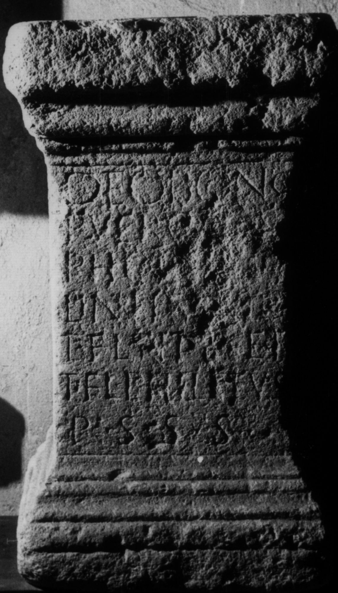

# EDH HD038500. Apulum, aus

**Країна.** Румунія

**Провінція (код EDH).** Dac

**Місце знахідки (антична назва).** Apulum, aus

**Сучасна назва.** Vinţu de Jos

**Координати.** 45.9920306,23.486467899

**Зберігання.** Alba Iulia, Muz. Unirii

**Датування (роки, від'ємні до н. е.).** 201 … 275

**Матеріал.** Kalkstein

**Тип пам'ятки.** Altar?

## Текст (латинь, скорочення розкрито)

```
Deo Bono / Puero P(h)os/phoro Apol/lini Pythio / T(itus) Fl(avius) Titus et / T(itus) Fl(avius) Philetus / p(ro) s(alute) s(ua) s(uorumque)
```

## Текст у вихідному записі

```
DEO BONO / PVERO POS / PHORO APOL / LINI PYTHIO / T FL TITVS ET / T FL PHILETVS / P S S S
```

## Коментар

Altar oder Statuenbasis. Inschriftfeld zum Teil verwittert.

## Література

IDR 3, 5, 306; Foto u. Zeichnung.
- CIL 03, 01133.
- ILS 4346. #

## Фото



Джерело https://edh.ub.uni-heidelberg.de/edh/inschrift/HD038500, ліцензія CC BY-SA 4.0. Оригінальний XML в архіві сирі_дані/edh_xml.zip
