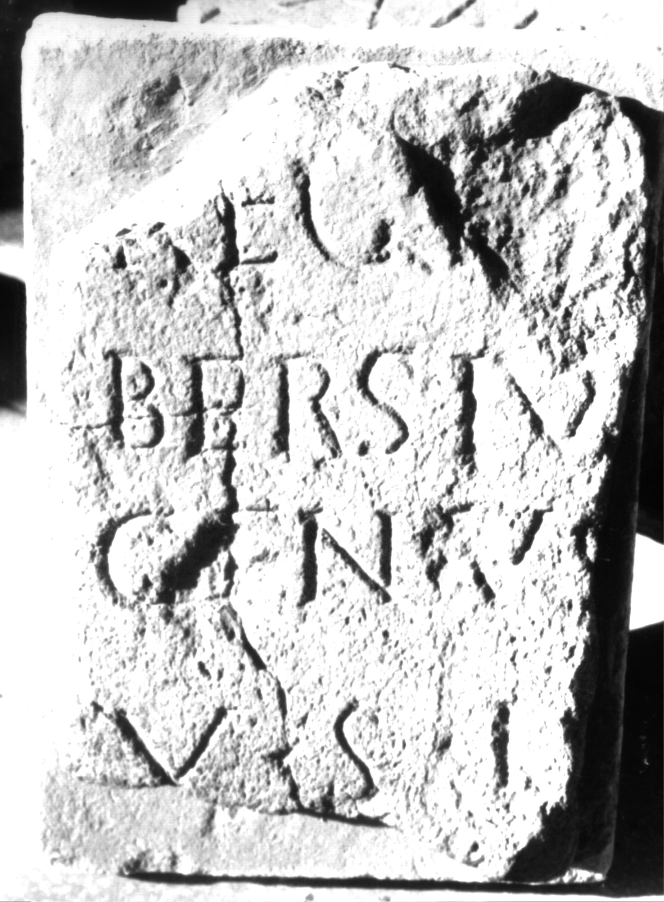
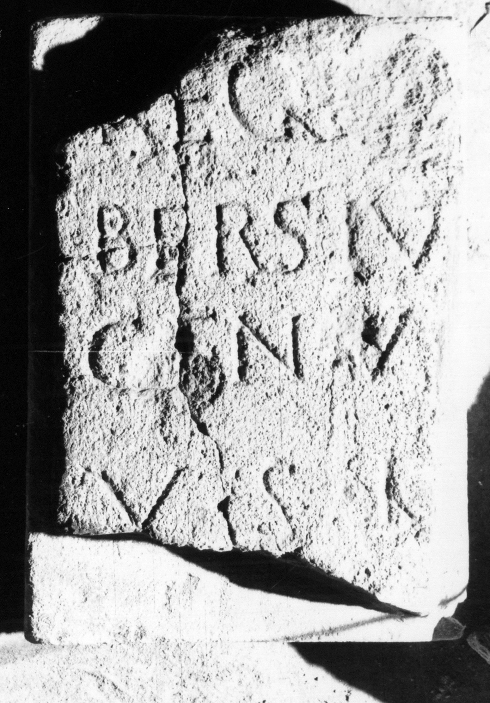

# EDH HD038511. Apulum

**Країна.** Румунія

**Провінція (код EDH).** Dac

**Місце знахідки (антична назва).** Apulum

**Сучасна назва.** Alba Iulia

**Координати.** 46.0669444,23.569999999

**Зберігання.** Alba Iulia, Muz. Unirii

**Датування (роки, від'ємні до н. е.).** 111 … 200

**Матеріал.** Kalkstein

**Тип пам'ятки.** Altar?

**Розміри (висота, ширина, глибина, см).** -32.0 × -23.0 × -5.0

## Текст (латинь, скорочення розкрито)

```
$] / regi[nae] / Bersiu[s In]/genu(u)s [---?] / v(otum) s(olvit) l(ibens) [m(erito)]
```

## Текст у вихідному записі

```
] / REGI[ ] / BERSIV[ ] / GENVS [ ] / V S L [ ]
```

## Коментар

Altar oder Statuenbasis. Nur ein Teil des Inschriftfeldes erhalten. Stein für eine spätereStein für eine Wiederverwendung bearbeitet.

## Література

IDR 3, 5, 312; Foto u. Zeichnung. #

## Фото





Джерело https://edh.ub.uni-heidelberg.de/edh/inschrift/HD038511, ліцензія CC BY-SA 4.0. Оригінальний XML в архіві сирі_дані/edh_xml.zip
