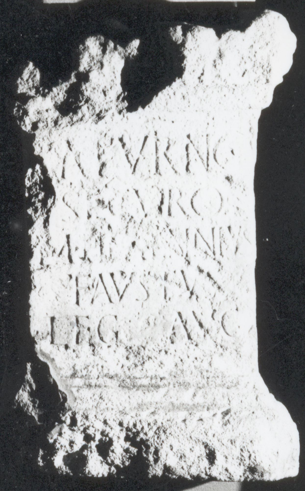

# EDH HD038513. Apulum, aus

**Країна.** Румунія

**Провінція (код EDH).** Dac

**Місце знахідки (антична назва).** Apulum, aus

**Сучасна назва.** Berghin

**Деталі знахідки.** {Straja}, Friedhof, sekundär verwendet

**Координати.** 46.067800685,23.683575689

**Зберігання.** Alba Iulia, Muz. Unirii

**Датування (роки, від'ємні до н. е.).** 115 … 117

**Матеріал.** Kalkstein

**Тип пам'ятки.** Altar

**Розміри (висота, ширина, глибина, см).** -68.0 × -45.0 × 31.0

## Текст (латинь, скорочення розкрито)

```
Saturno / Securo / M(arcus) Herennius / Faustus / leg(atus) Aug(usti)
```

## Текст у вихідному записі

```
SATVRNO / SECVRO / M HERENNIVS / FAVSTVS / LEG AVG
```

## Коментар

Bekrönung und Inschriftfeld zum Teil zerstört. Z. 4 u. 5: hederae.

## Література

IDR 3, 5, 314; Foto u. Zeichnung.
- AE 1962, 0206.
- D. Tudor, FA 13, 1958, 355, Nr. 5663. - AE 1962.
- AE 1975, 0718.
- L. Balla, in: EpStud 8 (Düsseldorf 1969) 35-39. - AE 1975. #

## Фото



Джерело https://edh.ub.uni-heidelberg.de/edh/inschrift/HD038513, ліцензія CC BY-SA 4.0. Оригінальний XML в архіві сирі_дані/edh_xml.zip
