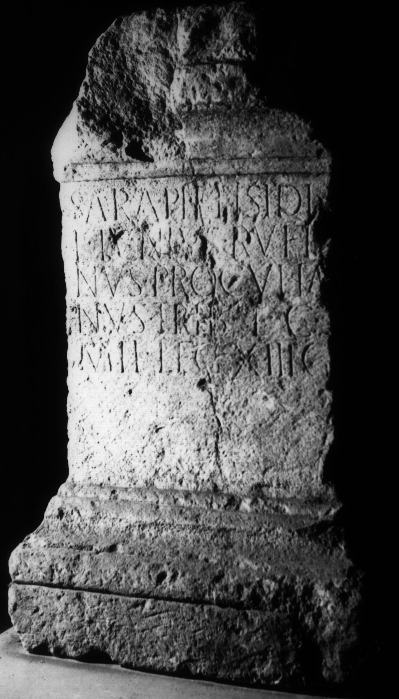

# EDH HD038518. Apulum

**Країна.** Румунія

**Провінція (код EDH).** Dac

**Місце знахідки (антична назва).** Apulum

**Сучасна назва.** Alba Iulia

**Деталі знахідки.** Praetorium des Statthalters

**Координати.** 46.076691,23.580099

**Рік знахідки.** 1878

**Зберігання.** Deva, Muz. Civil. Dac. şi Rom.

**Датування (роки, від'ємні до н. е.).** 151 … 170

**Матеріал.** Kalkstein

**Тип пам'ятки.** Altar?

**Розміри (висота, ширина, глибина, см).** -93.0 × 57.0 × 32.0

## Текст (латинь, скорочення розкрито)

```
Sarapi et Isidi / L(ucius) Iunius Rufi/nus Proculia/nus trib(unus) l(ati) c(lavius) / mil(itum) leg(ionis) XIII g(eminae)
```

## Текст у вихідному записі

```
SARAPI ET ISIDI / L IVNIVS RVFI / NVS PROCVLIA / NVS TRIB L C / MIL LEG XIII G
```

## Коментар

Altar oder Statuenbasis. (B): IDR: Z. 2: versehentlich Iulius statt Iunius.

## Література

IDR 3, 5, 318; Foto. (B)
- CIL 03, 07770.
- PIR (2. Aufl.) I 810.
- SIRIS 691.
- ILS 4382.
- L. Bricault, Recueil des inscriptions concernant les cultes Isiaques (RICIS) (Paris 2005) 731, Nr. 616/0403; pl. 127, 616/0403. #

## Фото



Джерело https://edh.ub.uni-heidelberg.de/edh/inschrift/HD038518, ліцензія CC BY-SA 4.0. Оригінальний XML в архіві сирі_дані/edh_xml.zip
